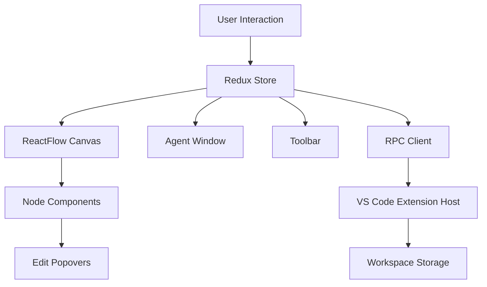

# AI Canvas Frontend Implementation Plan

## Overview

Build a VS Code extension webview featuring a Miro-like canvas for architectural modeling. The UI follows the specifications from Idea.pdf with a clean, single-tab interface: Left Toolbox + Main Canvas, with a floating draggable Agent window.

## Technology Stack

**Core Framework:**

- React 18.3 with TypeScript
- ReactFlow 11.11 for canvas rendering
- Redux Toolkit for state management
- CSS-in-JS using styled-components or CSS modules

**Build & Bundling:**

- Webpack 5 (already configured)
- TypeScript 5.9
- VS Code Extension API

**UI Components:**

- Custom components for Bucket/Module/Block nodes
- React DnD or native ReactFlow drag-and-drop
- Floating draggable window component

## Architecture

### State Management (Redux Toolkit)

```
store/
├── store.ts              # Configure Redux store
├── slices/
│   ├── entitiesSlice.ts  # Bucket/Module/Block data
│   ├── canvasSlice.ts    # ReactFlow nodes/edges, viewport
│   ├── uiSlice.ts        # Selection, scope, focus mode
│   └── agentSlice.ts     # Agent window state, history
└── selectors/
    ├── entitySelectors.ts
    └── canvasSelectors.ts
```

### Component Hierarchy

```
App
├── Toolbar (left vertical toolbox)
│   ├── CreateBucketButton
│   ├── CreateModuleButton
│   ├── CreateBlockButton
│   ├── ConnectModeToggle
│   └── FilterPanel
├── Canvas (main area)
│   ├── ReactFlowCanvas
│   │   ├── BucketNode (swimlane frame)
│   │   ├── ModuleNode (rectangular card)
│   │   ├── BlockNode (compact chip)
│   │   └── DependencyEdge (dashed with optional API marker)
│   ├── MiniMap (floating chip)
│   ├── ZoomControls (floating chip)
│   └── Breadcrumb (floating scope indicator)
└── AgentWindow (draggable overlay)
    ├── AgentHeader (scope chip, mode dropdown, controls)
    ├── AgentChatHistory
    ├── AgentInput
    └── AgentStatusLine
```

### Data Flow




## File Structure

```
ai-canvas/src/
├── webview/
│   ├── index.tsx                    # Entry point
│   ├── App.tsx                      # Main layout
│   ├── theme.css                    # Global styles (existing)
│   │
│   ├── store/                       # Redux state
│   │   ├── store.ts
│   │   ├── slices/
│   │   │   ├── entitiesSlice.ts
│   │   │   ├── canvasSlice.ts
│   │   │   ├── uiSlice.ts
│   │   │   └── agentSlice.ts
│   │   └── selectors/
│   │       ├── entitySelectors.ts
│   │       └── scopeSelectors.ts
│   │
│   ├── components/                  # Reusable UI components
│   │   ├── Toolbar/
│   │   │   ├── Toolbar.tsx
│   │   │   ├── ToolButton.tsx
│   │   │   └── FilterPanel.tsx
│   │   │
│   │   ├── Canvas/
│   │   │   ├── CanvasContainer.tsx
│   │   │   ├── Breadcrumb.tsx
│   │   │   ├── MiniMapControl.tsx
│   │   │   └── ZoomControl.tsx
│   │   │
│   │   ├── nodes/                   # ReactFlow node types
│   │   │   ├── BucketNode.tsx
│   │   │   ├── ModuleNode.tsx
│   │   │   ├── BlockNode.tsx
│   │   │   ├── NodeTooltip.tsx
│   │   │   └── nodeStyles.ts
│   │   │
│   │   ├── edges/                   # ReactFlow edge types
│   │   │   ├── DependencyEdge.tsx
│   │   │   ├── APIContractMarker.tsx
│   │   │   └── edgeStyles.ts
│   │   │
│   │   ├── popovers/               # Inline editing UI
│   │   │   ├── EditPopover.tsx
│   │   │   ├── BucketCreationModal.tsx
│   │   │   ├── EntityEditForm.tsx
│   │   │   └── APIContractPopover.tsx
│   │   │
│   │   ├── agent/                  # Agent conversation window
│   │   │   ├── AgentWindow.tsx
│   │   │   ├── AgentHeader.tsx
│   │   │   ├── AgentChatHistory.tsx
│   │   │   ├── AgentInput.tsx
│   │   │   ├── AgentStatusLine.tsx
│   │   │   ├── ScopeChip.tsx
│   │   │   └── ModeDropdown.tsx
│   │   │
│   │   └── shared/                 # Common components
│   │       ├── Button.tsx
│   │       ├── Input.tsx
│   │       ├── Dropdown.tsx
│   │       ├── Badge.tsx
│   │       └── Modal.tsx
│   │
│   ├── hooks/                      # Custom React hooks
│   │   ├── useEntityOperations.ts
│   │   ├── useCanvasInteractions.ts
│   │   ├── useScopeNavigation.ts
│   │   ├── useAgentWindow.ts
│   │   └── useRpcClient.ts
│   │
│   ├── utils/                      # Utility functions
│   │   ├── layout.ts              # Auto-layout algorithms
│   │   ├── entityHelpers.ts
│   │   ├── validations.ts
│   │   └── colors.ts
│   │
│   └── rpcClient/                  # Existing RPC layer
│       ├── rpcClient.ts
│       ├── messageChannel.ts
│       └── requestTracker.ts
│
├── shared/
│   ├── types/
│   │   ├── entities.ts            # Existing entity types
│   │   ├── rpc.ts                 # Existing RPC types
│   │   └── canvas.ts              # Canvas-specific types
│   └── schemas/
│       ├── entitySchema.ts        # Existing schemas
│       └── rpcSchema.ts
│
└── extension/                     # Extension host (existing)
    ├── extension.ts
    └── rpc/
        └── ...
```

## Key Features Implementation

### 1. Canvas Layout (Specs § 3-4)

**Main Layout:**

- Left: 60px vertical toolbox (fixed width)
- Right: Flex-1 canvas area
- No permanent inspector panels (popovers only)

**Toolbox buttons:**

- - Bucket → Opens creation modal with validation
- - Module → Places on canvas
- - Block → Places on canvas
- ↔ Connect → Toggle dependency drawing mode
- ⛃ Filter → Dropdown for status/tag/language filters

### 2. Entity Nodes (Specs § 5-7)

**Bucket Node:**

- Swimlane frame with header
- Header includes: name, runtime tag, progress bar (done/total), counts (Modules N · Blocks N), agents count
- Summary strip always visible
- Double-click: Enter Bucket Focus mode
- Hover: Show expanded tooltip with queue, dependencies, last activity
- Actions: Focus, Open (drill-in)

**Module Node:**

- Rectangular card with header + 1-line purpose
- Inline summary: Progress (done/total), Deps: N, Blocks: N
- Hover: Expanded tooltip with top 5 dependencies, "Start Agent ▶" button
- Double-click: Enter Module Focus mode
- Actions: Start Agent, Focus, Open

**Block Node:**

- Compact chip with file icon + extension badge
- Green glow effect when tests pass
- Hover: "Start Working ▶" button + path + test status
- Double-click: Open file in VS Code
- Actions: Start Working

### 3. Interactions (Specs § 5)

**Navigation:**

- Esc: Deselect
- Right-click + drag: Pan canvas
- Scroll wheel: Zoom
- Click: Select entity
- Drag-box: Multi-select
- Double-click: Drill into entity (Bucket/Module Focus)

**Breadcrumb Navigation:**

- Floating chip: "Workspace / BucketName / ModuleName"
- Click breadcrumb: Navigate up hierarchy
- Esc when nothing selected: Exit current scope

**Focus Modes:**

- Bucket Focus: Show only bucket's modules + blocks, others fade
- Module Focus: Show only module's blocks, others fade
- Layout: Auto-pack within focus area

### 4. Creation Flow (Specs § 5)

**Bucket Creation Modal (Required):**

- Name (text input, required)
- Short summary (textarea, 1-2 lines, required)
- Validation test (text input, command, required)
- Examples: `pnpm -C backend test`, `pytest -q`, `terraform validate`
- Only place bucket after all 3 filled

**Module/Block Creation:**

- Simple: Click toolbox button → Place on canvas at center
- Drag into parent to set containment

### 5. Dependency Edges (Specs § 6)

**Standard Dependency:**

- Dashed line with open arrowhead (UML style)
- Direction: depender → dependency
- Supports: Module→Module, Block→Block, Module→Bucket, Bucket→Bucket

**API Contract Marker (Optional):**

- Hollow circle on edge (contract point)
- Thin parallel line under edge (API channel indicator)
- Hover circle: Show tooltip with contract info
  - Contract name
  - Type: HTTP / gRPC / EVENT / QUEUE
  - Endpoint or topic
  - Auth: OAuth/mTLS/service-account
  - Version: v1/v2
- Click circle: Open API Contract edit popover

### 6. Agent Window (Specs § 6.5)

**Floating Draggable Window:**

- Overlay on canvas, draggable by header
- Resizable (constrained range), can minimize to pill
- Remembers position/size (localStorage)

**Header:**

- Scope chip: "Workspace / Bucket:name / Module:name / Block:path"
- Mode dropdown: Plan-only / Code+Tests / Tests-only / Documentation-only
- Buttons: Run ▶, Stop ■, Minimize ▾, Close ✕

**Body:**

- Chat history (scrollable)
- Message bubbles (user vs agent)
- Input box (single line, Shift+Enter for newline)
- Attachment chips (auto-added from selected nodes)
- Status line: "planning… / writing… / testing…"

**Scope Management:**

- Clicking entity sets agent window scope
- "Scope locked" indicator always visible
- Hover actions (Start Agent ▶, Start Working ▶) open/focus window with scope

### 7. Edit Popovers (Specs § 7)

**Popover UI (not permanent panels):**

- Appears near clicked node
- Small form with relevant fields
- Bucket: Name, summary, validation test, runtime tag
- Module: Name, purpose, manage dependencies
- Block: Name, file path, tags, status

**Right-click Context Menus:**

- Bucket: Rename, Duplicate, Delete, Add Module/Block, Set runtime tag, Edit validation
- Module: Rename, Duplicate, Delete, Add Block, Edit summary, Manage dependencies, Shift out of scope
- Block: Open file, Rename, Set file path, Set status, Run test, Delete

### 8. Visual Design (Specs § 6)

**Color Scheme (using VS Code theme variables):**

- Background: `--vscode-editor-background`
- Foreground: `--vscode-editor-foreground`
- Bucket: Blue accent (#2196f3)
- Module: Purple accent (#9c27b0)
- Block: Green accent (#4caf50)
- Test pass glow: Green shadow/glow effect

**Typography:**

- Font: VS Code font family
- Sizes: 10px (xs), 11px (sm), 12px (md), 13px (lg), 14px (xl)

**Spacing & Layout:**

- Consistent spacing scale: 4px, 8px, 12px, 16px, 24px
- Border radius: 4px (sm), 6px (md), 8px (lg), 12px (xl)

## Implementation Stages

### Stage 1: State Management Foundation

- Install Redux Toolkit
- Create store structure with slices
- Define entity operations (CRUD)
- Implement selectors for scope navigation
- Add RPC integration for persistence

### Stage 2: Canvas Core

- Set up ReactFlow in Canvas component
- Implement auto-layout algorithm
- Create custom node types (Bucket, Module, Block)
- Add zoom/pan controls
- Implement breadcrumb navigation

### Stage 3: Entity Nodes & Visual Design

- Build BucketNode with header summary
- Build ModuleNode with inline summary
- Build BlockNode with compact chip design
- Add hover tooltips with actions
- Implement test pass glow effect

### Stage 4: Interactions & Focus Modes

- Implement selection (single/multi)
- Add Bucket/Module Focus modes
- Implement drill-in/drill-out navigation
- Add keyboard shortcuts (Esc, Delete)
- Implement drag-to-reposition

### Stage 5: Creation & Edit Flow

- Build Bucket creation modal with validation
- Add Module/Block simple creation
- Implement drag-into-parent containment
- Build edit popovers for all entity types
- Add right-click context menus

### Stage 6: Dependencies & Edges

- Create DependencyEdge component
- Implement Connect mode (toolbox toggle)
- Add edge creation via drag
- Build API Contract marker
- Implement API Contract edit popover

### Stage 7: Agent Window

- Build draggable/resizable AgentWindow
- Implement header with scope chip & mode dropdown
- Add chat history display
- Build input area with attachments
- Add minimize/restore functionality
- Implement position/size persistence

### Stage 8: Toolbox & Filtering

- Build vertical left toolbox
- Add creation buttons
- Implement Connect mode toggle
- Build Filter panel (status/tag/language)
- Apply filters to canvas visibility

### Stage 9: Polish & Refinements

- Add loading states
- Implement error boundaries
- Add animations/transitions
- Optimize performance (memoization)
- Add accessibility attributes
- Test in VS Code dark/light themes

## Data Models

### Redux State Shape

```typescript
{
  entities: {
    byId: Record<EntityId, Entity>,
    allIds: EntityId[],
    containmentTree: Record<EntityId, EntityId[]>  // parent -> children
  },
  canvas: {
    nodes: Node[],  // ReactFlow nodes
    edges: Edge[],  // ReactFlow edges
    viewport: { x: number, y: number, zoom: number }
  },
  ui: {
    selectedIds: EntityId[],
    scopeEntityId: EntityId | null,
    focusMode: 'workspace' | 'bucket' | 'module',
    connectMode: boolean,
    filters: {
      status: EntityStatus[],
      tags: string[],
      languages: string[]
    }
  },
  agent: {
    isOpen: boolean,
    isMinimized: boolean,
    position: { x: number, y: number },
    size: { width: number, height: number },
    scopeEntityId: EntityId | null,
    mode: 'plan-only' | 'code+tests' | 'tests-only' | 'docs-only',
    history: ChatMessage[],
    status: 'idle' | 'planning' | 'writing' | 'testing'
  }
}
```

### ReactFlow Node Types

```typescript
type NodeType = 'bucket' | 'module' | 'block';

interface BaseNodeData {
  entity: Entity;
  isInScope: boolean;
  isDimmed: boolean;
}

interface BucketNodeData extends BaseNodeData {
  modulesCount: number;
  blocksCount: number;
  progress: { done: number; total: number };
  activeAgents: number;
}

interface ModuleNodeData extends BaseNodeData {
  depsCount: number;
  blocksCount: number;
  progress: { done: number; total: number };
}

interface BlockNodeData extends BaseNodeData {
  fileIcon: string;
  testPassed: boolean;
}
```

### Edge Types

```typescript
interface DependencyEdgeData {
  dependencyType: 'depends_on';
  hasApiContract: boolean;
  apiContract?: {
    name: string;
    type: 'HTTP' | 'gRPC' | 'EVENT' | 'QUEUE';
    endpoint: string;
    auth: string;
    version: string;
  };
}
```

## Dependencies to Add

```json
{
  "@reduxjs/toolkit": "^2.2.0",
  "react-redux": "^9.1.0",
  "react-draggable": "^4.4.6",
  "react-resizable": "^3.0.5",
  "@types/react-redux": "^7.1.33",
  "@types/react-draggable": "^4.4.7",
  "@types/react-resizable": "^3.0.8"
}
```

## Testing Approach

- Unit tests for Redux slices (actions, reducers, selectors)
- Component tests for node components
- Integration tests for creation/edit flows
- E2E tests for scope navigation and focus modes
- Visual regression tests for theme compatibility

## Performance Considerations

- Memoize expensive selectors with reselect
- Use React.memo for node components
- Virtualize large entity lists (if >1000 nodes)
- Debounce auto-save to RPC
- Lazy load agent window until first use

## Accessibility

- Keyboard navigation (Tab, Arrow keys)
- ARIA labels for all interactive elements
- Focus indicators
- Screen reader announcements for state changes
- High contrast mode support

## Migration Notes

The existing codebase has:

- ✅ RPC client/server infrastructure
- ✅ Entity type definitions
- ✅ Storage/persistence layer
- ✅ Basic theme CSS
- ❌ Store deleted (needs Redux recreation)
- ❌ Canvas components empty (needs implementation)
- ❌ No agent window components

We'll rebuild the state management with Redux Toolkit and implement all canvas components from scratch while preserving the existing RPC and extension infrastructure.