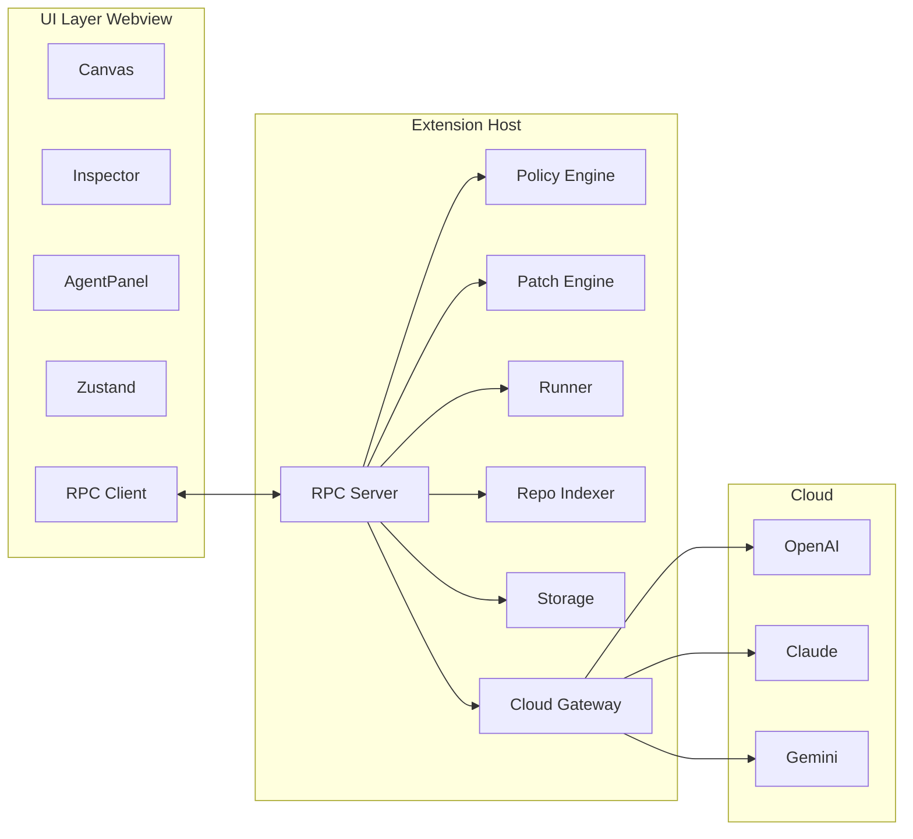

# AICT Implementation Plan (Specs-Aligned)

This plan implements the **Vibe Coding Canvas** (AICT) inside the existing [ai-canvas](ai-canvas/) extension, following [general_tech_spec.md](docs/general_tech_spec.md), [high_level_design.md](docs/high_level_design.md), and [implementation_spec.tex](docs/implementation_spec.tex).

---

## Architecture (from general_tech_spec)

- **Two pipes**: (1) Webview ↔ Extension Host via typed RPC; (2) Extension Host ↔ Cloud via HTTPS.
- **Minimal folder layout** (all under [ai-canvas/src](ai-canvas/src/)):
  - `src/extension/` → rpc, policy, patch, runner, repoIndex, storage, cloud
  - `src/webview/` → canvas, inspector, agentPanel, store, rpcClient
  - `src/shared/` → schemas (Zod), types (RPC, Job, Plan, Diff, entities)

---

## Phasing by MVP (from high_level_design)

| Phase     | Scope                      | Deliverables                                                                       |
| --------- | -------------------------- | ---------------------------------------------------------------------------------- |
| **MVP-0** | Canvas + data model        | Entities (Bucket/Module/Block), persist `.vibecanvas.json`, basic repo tree import |
| **MVP-1** | Planning + summaries       | AI summaries, exports/imports editing, dependency edges                            |
| **MVP-2** | Code generation + tests    | Generate patch, autogenerate block tests, run tests + logs                         |
| **MVP-3** | Recursive module self-test | Module harness composing child tests; “green means done”                           |
| **MVP-4** | GitHub + PR flow           | Branch/commit/PR, basic Issue sync                                                 |

---

## 1. Foundation: shared types and schemas

**Location**: `src/shared/` (implementation_spec § Shared Types and Schemas)

- **types**: [entities.ts](docs/implementation_spec.tex) (Entity, Bucket, Module, Block, EntityId), [rpc.ts](docs/implementation_spec.tex), [plan.ts](docs/implementation_spec.tex), [diff.ts](docs/implementation_spec.tex), [jobs.ts](docs/implementation_spec.tex), [context.ts](docs/implementation_spec.tex), [index.ts](docs/implementation_spec.tex) barrel.
- **schemas** (Zod): entitySchema, rpcSchema, planSchema, diffSchema, jobSchema, contextSchema.
- **Rule**: `src/shared/` must not depend on VS Code APIs or webview globals; internal imports use workspace-relative paths (e.g. `src/shared/types/rpc`).

**Dependencies to add**: `zod` (shared + extension + webview).

---

## 2. Extension host layout and entry

**Location**: `src/extension.ts` (existing) + `src/extension/*`

- Keep [extension.ts](ai-canvas/src/extension.ts) as entry: register command, create webview panel, resolve `extensionUri`, and wire transport.
- Add folders under `src/extension/` as per implementation_spec:
  - **rpc**: rpcServer, rpcHandlers, rpcValidation, rpcTransport (webview bridge).
  - **storage**: workspaceStore (`.vibecanvas.json`), cacheStore (`.vibecanvas.cache.json`), storagePaths, storageTypes.
  - **policy**: policyEngine, scopeFence, commandAllowlist, dependencyGate, networkPolicy.
  - **patch**: patchEngine, diffValidator, patchApplier, formatRunner, patchTypes.
  - **runner**: commandRunner, runQueue, outputTruncation.
  - **repoIndex**: repoIndexer, manifestScanner, importGraph, testCommandDiscovery, symbolTable.
  - **cloud**: gatewayClient, providerAdapter, openaiAdapter, claudeAdapter, geminiAdapter, contextPackager, batchPlanner, outputValidators, rateLimiter.

**Webpack**: Ensure entry remains `extension.ts` and that `src/extension/**` and `src/shared/**` are included (no separate bundles for subfolders unless you add webview bundle later).

---

## 3. Webview UI layout and build

**Location**: `src/webview/*`

- **Build**: Add a separate webpack (or esbuild) target for the webview: bundle React app into a single JS (and optional CSS) that the webview HTML loads via `vscode-resource:` or nonce-based script.
- **Folders** (implementation_spec):
  - **rpcClient**: rpcClient, messageChannel, requestTracker (typed postMessage bridge).
  - **store**: appStore, canvasStore, selectors, actions (Zustand).
  - **canvas**: CanvasView.tsx, nodeTypes, edgeTypes, layoutHelpers, selectionController (React Flow).
  - **inspector**: InspectorPanel, EntityForm, ExportsImportsEditor, AcceptanceCriteriaList, TestStrategyEditor.
  - **agentPanel**: AgentPanel, ChatThread, JobStatusList, DiffPreview, ApprovalPrompt.

**Dependencies to add**: `react`, `react-dom`, `reactflow`, `zustand`. Types: `@types/react`, `@types/react-dom`.

---

## 4. MVP-0: Canvas + data model

- **Shared**: Implement entity types and entitySchema (Bucket/Module/Block, relationships, minimal JSON shape from high_level_design § 2).
- **Extension**:
  - **storage**: workspaceStore load/save `.vibecanvas.json` with atomic write; storagePaths, storageTypes.
  - **rpc**: Minimal RPC server + webview transport; handlers for `loadWorkspaceState`, `saveWorkspaceState`, and optionally `repoIndex` (stub or simple file tree).
- **Webview**:
  - **store**: appStore (entities, selection), canvasStore (viewport, nodes/edges).
  - **canvas**: CanvasView with React Flow, nodeTypes (bucket/module/block), edgeTypes (containment, dependency), layoutHelpers (snapToGrid, computeBounds), selectionController.
  - **inspector**: InspectorPanel + EntityForm (name, description, size_hint, status) bound to selected entity; persist via RPC.
- **Activation**: On `aiCanvas.open`, open webview, inject script, create RPC transport, call `loadWorkspaceState` and optionally seed from repo (e.g. list of files under workspace).

**Outcome**: User can create/edit Bucket/Module/Block, arrange on canvas, persist to `.vibecanvas.json`, and optionally import basic repo tree into blocks.

---

## MVP-0: Detailed Implementation Plan

### MVP-0 Features

**User-facing**

- **Open canvas**: Command `aiCanvas.open` opens a webview panel with the canvas; panel state (title, icon) is set.
- **Entity model**: Three entity types — **Bucket** (top-level, no child buckets), **Module** (can contain submodules and blocks), **Block** (smallest unit, typically a file). Each has: `id` (UUID), `type`, `name`, `path` (optional), `purpose`, `exports`/`imports`/`deps` (arrays), `children` (entity IDs), `tests` (block_test, module_test optional), `size_hint` (xs|s|m|l|xl), `status` (todo|doing|review|done).
- **Canvas interactions**: Drag nodes to arrange; **containment edges** (Bucket→Module, Module→Module/Block); **dependency edges** (Module↔Module, Block↔Block) — MVP-0 can implement containment only and stub dependency edges. Zoom, pan, mini-map (React Flow built-ins). **Snap-to-grid** and **multi-select** (Shift+click).
- **Inspector panel (right)**: When an entity is selected, show **EntityForm**: edit **name**, **description** (purpose), **size_hint**, **status** with validation; submit updates to store and persist via RPC.
- **Persistence**: Workspace state (entities + canvas positions) saved to `.vibecanvas.json` at workspace root; **atomic write** (write to temp then rename). Load on open; save on entity/create/update/delete and on canvas layout changes (debounced).
- **Basic repo import (optional)**: Action “Import repo tree” or similar: extension lists files under workspace (e.g. `vscode.workspace.findFiles` with ignore); UI creates Blocks (or a single Module with Blocks) from file paths. No import graph or manifests in MVP-0.

**Internal / non-UI**

- **Shared types and schemas**: Single source of truth for Entity, Bucket, Module, Block, EntityId; WorkspaceState (entities + optional canvas layout); Zod schemas for validation on load/save and RPC.
- **Extension host**: Storage (paths, load/save workspace state); RPC server over webview transport with handlers `loadWorkspaceState`, `saveWorkspaceState`, and optionally `listWorkspaceFiles` (for repo import).
- **Webview**: RPC client (postMessage bridge); Zustand stores (app state + canvas state); React Flow canvas with custom node/edge types; inspector bound to selection.

---

### MVP-0 Tech Stack

| Layer              | Stack                                               | Notes                                                                                             |
| ------------------ | --------------------------------------------------- | ------------------------------------------------------------------------------------------------- |
| **Language**       | TypeScript (strict)                                 | All `ai-canvas/src` code; shared code has no Node/VS Code imports.                                |
| **Shared**         | Zod                                                 | Schemas for entities and RPC payloads; types inferred where possible.                             |
| **Extension host** | Node (VS Code API), `node:fs/promises`, `node:path` | Entry: `extension.ts`; storage and RPC run in extension host.                                     |
| **Webview UI**     | React 18, React DOM                                 | Single SPA mounted in webview.                                                                    |
| **Canvas**         | React Flow                                          | Nodes/edges, zoom, pan, mini-map; custom `nodeTypes` and `edgeTypes`.                             |
| **State**          | Zustand                                             | `appStore` (entities, selection, UI state), `canvasStore` (nodes, edges, viewport).               |
| **Bridge**         | Typed postMessage                                   | RPC over `webview.postMessage` / `onDidReceiveMessage`; request ID and promise mapping on client. |
| **Build**          | Webpack (existing)                                  | Extension bundle: entry `extension.ts`; add second target for webview JS (and optional CSS).      |

**New dependencies (MVP-0)**

- **Production**: `zod`, `react`, `react-dom`, `reactflow`, `zustand`.
- **Dev**: `@types/react`, `@types/react-dom`.
- **No** policy/patch/runner/cloud/repoIndex implementation in MVP-0 — only storage and minimal RPC.

---

### MVP-0 Implementation Steps (ordered)

**Step 1 — Shared types (entities + workspace state)**

- Add `ai-canvas/src/shared/types/entities.ts`: export `Entity`, `Bucket`, `Module`, `Block`, `EntityId` (discriminated union on `type`); `WorkspaceState` (e.g. `{ entities: Entity[]; canvas?: { nodes: …; edges: … } }` or equivalent for React Flow).
- Add `ai-canvas/src/shared/types/rpc.ts`: `RpcRequest`, `RpcResponse`, `RpcMethod`; for MVP-0 only `loadWorkspaceState`, `saveWorkspaceState`, and optionally `listWorkspaceFiles` (payload/response types).
- Add `ai-canvas/src/shared/types/index.ts`: re-export from `entities` and `rpc` (and placeholder exports for `plan`, `diff`, `jobs`, `context` if needed by schemas).
- **Convention**: All paths under `src/shared` use workspace-relative imports; no `vscode` or webview globals.

**Step 2 — Shared schemas (Zod)**

- Add `ai-canvas/src/shared/schemas/entitySchema.ts`: `BucketSchema`, `ModuleSchema`, `BlockSchema`, `EntitySchema` (discriminated), `WorkspaceStateSchema` (entities + optional layout).
- Add `ai-canvas/src/shared/schemas/rpcSchema.ts`: `RpcRequestSchema`, `RpcResponseSchema` for the three methods above (method + params/result).
- **Exports**: As per implementation_spec (entitySchema, rpcSchema).

**Step 3 — Extension storage**

- Add `ai-canvas/src/extension/storage/storagePaths.ts`: `getWorkspaceFilePath(root)`, `getCacheFilePath(root)`; resolve `.vibecanvas.json` and `.vibecanvas.cache.json` under workspace root (use `vscode.workspace.workspaceFolders?.[0]?.uri.fsPath` when calling).
- Add `ai-canvas/src/extension/storage/storageTypes.ts`: `WorkspaceState`, `CacheState`, `StorageError` (or reuse from shared types where applicable).
- Add `ai-canvas/src/extension/storage/workspaceStore.ts`: `loadWorkspaceState(root)`, `saveWorkspaceState(root, state)`; read/write JSON, validate with `WorkspaceStateSchema`, atomic write (write to temp file then rename).
- Add `ai-canvas/src/extension/storage/cacheStore.ts`: stub `loadCache`/`saveCache` (return empty/default) for future repo index cache.

**Step 4 — Extension RPC (minimal)**

- Add `ai-canvas/src/extension/rpc/rpcTransport.ts`: `createWebviewTransport(webview)`, `RpcTransport` interface (send message, subscribe to messages, assign request IDs).
- Add `ai-canvas/src/extension/rpc/rpcValidation.ts`: `validateRpcRequest`, `validateRpcResponse` using rpcSchema (Zod).
- Add `ai-canvas/src/extension/rpc/rpcServer.ts`: `createRpcServer(options)`, `RpcServer`, `RpcServerOptions`; listen on transport, route by method, call handlers, return structured errors on unknown method or handler throw.
- Add `ai-canvas/src/extension/rpc/rpcHandlers.ts`: `RpcHandlerRegistry`, `registerMvp0Handlers(deps)` (or minimal register) with deps `{ loadWorkspaceState, saveWorkspaceState, listWorkspaceFiles? }`; implement `loadWorkspaceState` (return workspace state), `saveWorkspaceState` (write and return ok), optional `listWorkspaceFiles` (e.g. `vscode.workspace.findFiles` → list of relative paths).

**Step 5 — Webview build**

- Add webpack config (or extend existing) with a second entry for webview: e.g. `webview/index.tsx` → output `dist/webview.js` (and optional `webview.css`). Ensure React/ReactFlow are bundled for webview only, not in extension bundle.
- Add `ai-canvas/src/webview/index.html` (or inline HTML in extension): script tag loading `vscode-resource:`/`webview.js`; root div for React mount; pass `acquireVsCodeApi()` into app for postMessage.
- In `extension.ts`: when creating webview, set `webview.asWebviewUri` for script; inject script URI into HTML.

**Step 6 — Webview RPC client**

- Add `ai-canvas/src/webview/rpcClient/messageChannel.ts`: wrap `postMessage` and message listener; `createMessageChannel(getApi)` with typed send/onMessage.
- Add `ai-canvas/src/webview/rpcClient/requestTracker.ts`: `RequestTracker` — map request ID to pending promise; resolve on response or timeout.
- Add `ai-canvas/src/webview/rpcClient/rpcClient.ts`: `createRpcClient()`, `RpcClient` with methods `loadWorkspaceState()`, `saveWorkspaceState(state)`, optional `listWorkspaceFiles()`; use messageChannel + requestTracker.

**Step 7 — Webview store (Zustand)**

- Add `ai-canvas/src/webview/store/appStore.ts`: `useAppStore` — state: `entities: Entity[]`, `selectedEntityId: EntityId | null`, optional `workspaceRoot: string`; actions: `setEntities`, `setSelectedEntity`, `createEntity`, `updateEntity`, `deleteEntity`, `loadState(state)`.
- Add `ai-canvas/src/webview/store/canvasStore.ts`: `useCanvasStore` — state: React Flow nodes/edges (derived from entities + containment/dependency), viewport; actions: `setNodes`, `setEdges`, `setViewport`, `syncFromEntities(entities)` (map entities to nodes with positions), `syncToEntities()` (optional, for layout → entity data if needed).
- Add `ai-canvas/src/webview/store/selectors.ts`: `selectActiveEntity`, `selectEntityById` (memoized or simple functions).
- Add `ai-canvas/src/webview/store/actions.ts`: `createEntity`, `updateEntity`, `setJobStatus` (stub for MVP-0); call appStore and, for create/update/delete, call `rpcClient.saveWorkspaceState(serializedState)` after debounce or on explicit save.

**Step 8 — Webview canvas (React Flow)**

- Add `ai-canvas/src/webview/canvas/nodeTypes.tsx`: custom node renderers for `bucket`, `module`, `block` (shape/label from entity); export `nodeTypes` map.
- Add `ai-canvas/src/webview/canvas/edgeTypes.tsx`: edge renderers for `containment`, `dependency`; export `edgeTypes`.
- Add `ai-canvas/src/webview/canvas/layoutHelpers.ts`: `snapToGrid`, `computeBounds` (for layout/drag).
- Add `ai-canvas/src/webview/canvas/selectionController.ts`: `useSelectionController` — sync React Flow selection to `appStore.selectedEntityId`; handle multi-select (e.g. Shift+click) if desired.
- Add `ai-canvas/src/webview/canvas/CanvasView.tsx`: mount React Flow with `nodeTypes`, `edgeTypes`, `onSelectionChange` → selectionController; bind nodes/edges from canvasStore; use `snapToGrid` in node drag.

**Step 9 — Webview inspector**

- Add `ai-canvas/src/webview/inspector/EntityForm.tsx`: form fields for `name`, `purpose` (description), `size_hint` (dropdown), `status` (dropdown); validate with entitySchema; on submit call `updateEntity` and trigger save via RPC.
- Add `ai-canvas/src/webview/inspector/InspectorPanel.tsx`: if no selection, show “Select an entity”; else render `EntityForm` for `selectActiveEntity()`; panel layout (title “Inspector”, scrollable form).

**Step 10 — Extension entry and webview bootstrap**

- Update `ai-canvas/src/extension.ts`: On `aiCanvas.open`, create `WebviewPanel` with retain context; set HTML with script pointing to `asWebviewUri(scriptUri)`; create RPC transport with `createWebviewTransport(panel.webview)`; create RPC server with MVP-0 handlers (storage); call `loadWorkspaceState` and post initial state to webview (e.g. via a dedicated “init” message or by webview calling `loadWorkspaceState()` on load). When webview sends `saveWorkspaceState`, handler writes and returns.
- Add `ai-canvas/src/webview/App.tsx` (or equivalent): root component that renders a layout with `CanvasView` (main area) and `InspectorPanel` (right sidebar); on mount call `rpcClient.loadWorkspaceState()` and `appStore.loadState(result)`; wire save (e.g. on entity update or “Save” button) to `rpcClient.saveWorkspaceState(serializedState)`.

**Step 11 — Optional: basic repo import**

- Extension: implement `listWorkspaceFiles` (e.g. `vscode.workspace.findFiles('**/*', ignore)`) and return list of relative paths (or path + simple file type).
- Webview: add “Import repo tree” (or “Add from workspace”) in toolbar/panel; call `listWorkspaceFiles()`; create one Module per folder and Block per file (or flat list of Blocks); add to entities and sync to canvas; then `saveWorkspaceState`.

**Step 12 — Persistence and UX polish**

- Debounce `saveWorkspaceState` on entity or canvas changes (e.g. 500–1000 ms) to avoid excessive writes.
- Handle empty workspace: if no `.vibecanvas.json`, `loadWorkspaceState` returns default `{ entities: [], canvas: undefined }`.
- Ensure Bucket rule: buckets cannot contain buckets; validation in EntityForm or on drop.

---

### MVP-0 File Summary

| Area                  | Files to add                                                                                                        |
| --------------------- | ------------------------------------------------------------------------------------------------------------------- |
| **Shared**            | `src/shared/types/entities.ts`, `rpc.ts`, `index.ts`; `src/shared/schemas/entitySchema.ts`, `rpcSchema.ts`          |
| **Extension storage** | `src/extension/storage/storagePaths.ts`, `storageTypes.ts`, `workspaceStore.ts`, `cacheStore.ts`                    |
| **Extension RPC**     | `src/extension/rpc/rpcTransport.ts`, `rpcValidation.ts`, `rpcServer.ts`, `rpcHandlers.ts`                           |
| **Webview build**     | Webpack entry for webview; HTML template or inline in extension                                                     |
| **Webview RPC**       | `src/webview/rpcClient/messageChannel.ts`, `requestTracker.ts`, `rpcClient.ts`                                      |
| **Webview store**     | `src/webview/store/appStore.ts`, `canvasStore.ts`, `selectors.ts`, `actions.ts`                                     |
| **Webview canvas**    | `src/webview/canvas/CanvasView.tsx`, `nodeTypes.tsx`, `edgeTypes.tsx`, `layoutHelpers.ts`, `selectionController.ts` |
| **Webview inspector** | `src/webview/inspector/InspectorPanel.tsx`, `EntityForm.tsx`                                                        |
| **Webview root**      | `src/webview/index.tsx` (or `App.tsx` + index), mount React to root div                                             |
| **Entry**             | Update `src/extension.ts`: webview panel, HTML with script, RPC transport + server, load/save wiring                |

**Outcome**: User can open the canvas, create/edit Bucket/Module/Block, arrange with containment edges, edit name/description/size_hint/status in the inspector, and persist to `.vibecanvas.json`; optional import of workspace file list as blocks.

---

## 5. MVP-1: Planning + summaries

- **Extension**:
  - **repoIndex**: repoIndexer, manifestScanner, importGraph (TS/JS via TypeScript API, Python best-effort), symbolTable (exported symbols); cache in cacheStore.
  - **cloud**: contextPackager (buildContextBundle with byte/token caps), gatewayClient + one provider adapter (e.g. OpenAI), outputValidators (validatePlan). RateLimiter and batchPlanner (planBatches) as needed for “summarize” and “plan” flows.
- **RPC**: Handlers for `repoIndex`, `startWork` (plan-only or summarize) using context bundle and provider; return plan or summary text.
- **Webview**:
  - **inspector**: ExportsImportsEditor with autocomplete from repo index; optional “Summarize” / “Plan” button that calls `startWork` and updates entity purpose or plan.
  - **canvas**: Dependency edges (from import graph or manual) and display in edgeTypes.
- **Policy**: scopeFence and policyEngine so that only files under selected scope are included in context; no writes outside scope.

**Outcome**: AI summaries for entities; manual exports/imports editing with autocomplete; dependency edges on canvas.

---

## 6. MVP-2: Code generation with tests

- **Extension**:
  - **patch**: patchEngine (validate → dry-run → optional format → apply), diffValidator, patchApplier, formatRunner (allowlist-checked); patchTypes.
  - **runner**: commandRunner (spawn, timeouts, env), runQueue, outputTruncation; integrate commandAllowlist (policy).
  - **cloud**: batchPlanner (PLAN → PATCH stages), validateDiff; adapters for generate + test-explain.
- **RPC**: Handlers for `startWork` (code+tests), `runTests`, `applyPatch`, `cancelJob`. startWork returns patches; runTests runs allowlisted test commands and returns logs (truncated); applyPatch applies after approval.
- **Webview**:
  - **agentPanel**: JobStatusList, DiffPreview (unified diff with line numbers), ApprovalPrompt (approve/reject patch).
  - **store**: Job state and status updates from RPC events.
- **Policy**: dependencyGate (detect manifest/lockfile changes, require approval); networkPolicy for test runs (e.g. block network by default).

**Outcome**: Generate patch for selected blocks; autogenerate block tests; run tests and show logs; approve → apply patch.

---

## 7. MVP-3: Recursive module self-test

- **Extension**: Repo index and cloud batchPlanner: support module-level test discovery (testCommandDiscovery) and module harness generation; runner runs composed harness.
- **RPC**: Same `runTests` / `startWork` but with scope = module (run module harness); startWork can request “module self-test” generation.
- **Webview**: Inspector TestStrategyEditor for module test command and expectations; Agent panel shows “green when module harness passes”.
- **High-level design**: Recursive planning step 8 — module self-test script that composes child tests; “green means done” for module when harness passes.

**Outcome**: Module harness that composes child tests; “green means done” workflow at module level.

---

## 8. MVP-4: GitHub + PR flow

- **Extension**: Use simple-git (or VS Code Git API) for branch, commit, push; optional GitHub API client for PR and Issues (minimal: create Issue from entity, create PR for scope, update status).
- **RPC**: Handlers e.g. `createBranch`, `commit`, `createPR`, `createIssue`, `syncStatus`.
- **Webview**: Inspector or action bar: “Create branch + commit + PR”, “Create Issue”; optional Kanban view syncing status to GitHub.

**Outcome**: Branch/commit/PR for selected scope; basic Issue sync.

---

## 9. Cross-cutting and conventions

- **Imports**: Internal workspace-relative paths (e.g. `src/shared/types/rpc`, `src/extension/policy`).
- **Errors**: Structured error responses from RPC (implementation_spec: malformed payloads, unknown method, handler errors → structured error response).
- **Guardrails** (high_level_design § 8): Scope-limited writes (policy scopeFence); dependency changes require approval (dependencyGate); no arbitrary shell (commandAllowlist); optional secret redaction in contextPackager.
- **Naming**: Specs use `.vibecanvas.json` and `.vibecanvas.cache.json`; keep filenames as in implementation_spec.

---

## 10. Suggested implementation order (summary)

1. **Shared** — types + schemas (entities, rpc, plan, diff, jobs, context).
2. **Extension host** — storage (workspace + cache paths, load/save); then rpc (transport, server, validation, minimal handlers).
3. **Webview build** — webpack target for webview; HTML + script injection from extension.
4. **Webview** — rpcClient + store; then canvas (CanvasView, nodes, edges, selection); then inspector (EntityForm, persist).
5. **MVP-0** — End-to-end: open webview, load/save state, create/edit entities, basic repo import.
6. **MVP-1** — repoIndex, cloud (one adapter + contextPackager), policy scopeFence; ExportsImportsEditor, dependency edges.
7. **MVP-2** — patch engine, runner, command allowlist, dependency gate; AgentPanel (jobs, diff, approval).
8. **MVP-3** — Module test discovery and harness generation; “green means done” UI.
9. **MVP-4** — Git + GitHub (branch, commit, PR, Issue sync).

This order keeps dependencies aligned with the implementation_spec (e.g. rpc depends on policy, patch, runner, repoIndex, storage, cloud; webview store and canvas depend on shared types and rpcClient).