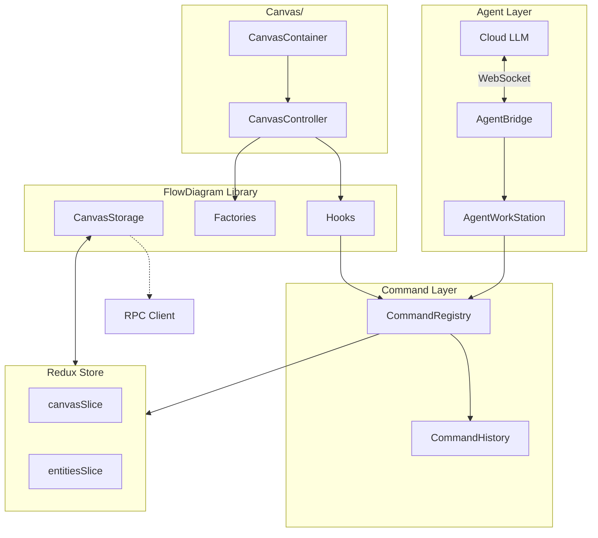

# FlowDiagram Architecture: Custom Canvas with OOP and Redux

## Overview

Build a custom `FlowDiagram` library inside `components/FlowDiagram/`. This folder provides base abstractions, factory classes, and reusable hooks. The `nodes/` and `edges/` folders contain type-specific implementations. The `Canvas/` folder consumes FlowDiagram to render the diagram. Redux is the single source of truth; `CanvasStorage` wraps RPC for JSON file persistence.

## Type Summary

### Node Types


| Type           | Description                                              |
| -------------- | -------------------------------------------------------- |
| `bucket`       | Top-level container (service, package)                   |
| `module`       | Logical grouping within a bucket                         |
| `block`        | Function, class, or generic component                    |
| `api_contract` | Interface definition between components (special module) |


### Edge Types


| Type         | Description                                |
| ------------ | ------------------------------------------ |
| `dependency` | General relationship (import, uses, calls) |
| `api`        | Connection to/from an API Contract node    |


Edges are **bidirectional** - stored as `nodes: [string, string]` with no inherent direction. Edge endpoints are draggable for reassignment.

## Architecture Overview




**Key principle:** All mutations (user and agent) go through `CommandRegistry`, enabling unified undo/redo and operation logging.

---

## Command Layer

### Location

```
webview/
  commands/
    types.ts              # Command and result types
    CommandHistory.ts     # Undo/redo stack
    CommandRegistry.ts    # Execute, undo, redo
    index.ts             # Public exports
```

### Command Types

**File:** `commands/types.ts`

```typescript
// Command definitions - one per mutation type
export type CanvasCommand =
  | { type: 'CREATE_ENTITY'; payload: { entityType: EntityType; name: string; purpose: string; parentId?: string } }
  | { type: 'UPDATE_ENTITY'; payload: { id: string; updates: Partial<Entity> } }
  | { type: 'DELETE_ENTITY'; payload: { id: string } }
  | { type: 'MOVE_ENTITY'; payload: { id: string; newParentId: string | null } }
  | { type: 'SET_ENTITY_STATUS'; payload: { id: string; status: EntityStatus } }
  | { type: 'CREATE_EDGE'; payload: { nodes: [string, string]; type: EdgeType } }
  | { type: 'UPDATE_EDGE'; payload: { id: string; nodes: [string, string] } }
  | { type: 'DELETE_EDGE'; payload: { id: string } }
  | { type: 'SET_NODE_POSITION'; payload: { id: string; position: Position } }
  | { type: 'SET_NODE_SIZE'; payload: { id: string; size: Size } }
  | { type: 'SET_VIEWPORT'; payload: Viewport }
  | { type: 'SET_SCOPE'; payload: { entityId: string | null } }  // Scope navigation (double-click)
  | { type: 'BATCH'; payload: { commands: CanvasCommand[] } };

// Result of command execution
export interface CommandResult {
  success: boolean;
  data?: unknown;           // Created entity, etc.
  error?: CommandError;
}

export interface CommandError {
  code: string;
  message: string;
  suggestion?: string;      // Helpful hint for recovery
}

// Stored in history for undo
export interface ExecutedCommand {
  command: CanvasCommand;
  inverse: CanvasCommand;   // Command to undo this one
  timestamp: number;
}
```

### CommandHistory

**File:** `commands/CommandHistory.ts`

```typescript
import type { ExecutedCommand, CanvasCommand } from './types';

export class CommandHistory {
  private undoStack: ExecutedCommand[] = [];
  private redoStack: ExecutedCommand[] = [];
  private maxSize: number;

  constructor(maxSize = 100) {
    this.maxSize = maxSize;
  }

  // Record a command that was executed
  push(executed: ExecutedCommand): void {
    this.undoStack.push(executed);
    this.redoStack = [];  // Clear redo stack on new command
    
    // Limit history size
    if (this.undoStack.length > this.maxSize) {
      this.undoStack.shift();
    }
  }

  // Get command to undo (returns the inverse command)
  popUndo(): ExecutedCommand | null {
    const executed = this.undoStack.pop();
    if (executed) {
      this.redoStack.push(executed);
    }
    return executed ?? null;
  }

  // Get command to redo (returns the original command)
  popRedo(): ExecutedCommand | null {
    const executed = this.redoStack.pop();
    if (executed) {
      this.undoStack.push(executed);
    }
    return executed ?? null;
  }

  canUndo(): boolean {
    return this.undoStack.length > 0;
  }

  canRedo(): boolean {
    return this.redoStack.length > 0;
  }

  clear(): void {
    this.undoStack = [];
    this.redoStack = [];
  }

  // For debugging/display
  getUndoStackSize(): number {
    return this.undoStack.length;
  }

  getRedoStackSize(): number {
    return this.redoStack.length;
  }
}
```

### CommandRegistry

**File:** `commands/CommandRegistry.ts`

```typescript
import type { AppDispatch, RootState } from '../store';
import type { CanvasCommand, CommandResult, ExecutedCommand } from './types';
import { CommandHistory } from './CommandHistory';

// Redux action imports
import { addEntity, updateEntity, deleteEntity, setEntityStatus } from '../store/slices/entitiesSlice';
import { addEdge, updateEdge, removeEdge, setNodePosition, setNodeSize, setViewport } from '../store/slices/canvasSlice';
import { setScopeEntityId } from '../store/slices/uiSlice';

export class CommandRegistry {
  private dispatch: AppDispatch;
  private getState: () => RootState;
  private history: CommandHistory;

  constructor(dispatch: AppDispatch, getState: () => RootState, history?: CommandHistory) {
    this.dispatch = dispatch;
    this.getState = getState;
    this.history = history ?? new CommandHistory();
  }

  // Execute a command and record for undo
  execute(command: CanvasCommand): CommandResult {
    try {
      // Capture state before for inverse calculation
      const inverse = this.computeInverse(command);
      
      // Execute the command
      const result = this.executeCommand(command);
      
      if (result.success && inverse) {
        this.history.push({
          command,
          inverse,
          timestamp: Date.now(),
        });
      }
      
      return result;
    } catch (e) {
      return {
        success: false,
        error: { code: 'EXECUTION_ERROR', message: e.message },
      };
    }
  }

  // Undo last command
  undo(): CommandResult {
    const executed = this.history.popUndo();
    if (!executed) {
      return { success: false, error: { code: 'NOTHING_TO_UNDO', message: 'No commands to undo' } };
    }
    // Execute the inverse command (don't record in history)
    return this.executeCommand(executed.inverse);
  }

  // Redo last undone command
  redo(): CommandResult {
    const executed = this.history.popRedo();
    if (!executed) {
      return { success: false, error: { code: 'NOTHING_TO_REDO', message: 'No commands to redo' } };
    }
    // Re-execute the original command (don't record in history)
    return this.executeCommand(executed.command);
  }

  canUndo(): boolean {
    return this.history.canUndo();
  }

  canRedo(): boolean {
    return this.history.canRedo();
  }

  // Execute without recording (used for undo/redo)
  private executeCommand(command: CanvasCommand): CommandResult {
    switch (command.type) {
      case 'CREATE_ENTITY': {
        const entity = this.dispatch(addEntity(command.payload));
        return { success: true, data: entity };
      }
      case 'UPDATE_ENTITY': {
        this.dispatch(updateEntity(command.payload));
        return { success: true };
      }
      case 'DELETE_ENTITY': {
        this.dispatch(deleteEntity(command.payload.id));
        return { success: true };
      }
      case 'SET_ENTITY_STATUS': {
        this.dispatch(setEntityStatus(command.payload));
        return { success: true };
      }
      case 'CREATE_EDGE': {
        const id = `edge-${Date.now()}`;
        this.dispatch(addEdge({ id, ...command.payload }));
        return { success: true, data: { id } };
      }
      case 'UPDATE_EDGE': {
        this.dispatch(updateEdge(command.payload));
        return { success: true };
      }
      case 'DELETE_EDGE': {
        this.dispatch(removeEdge(command.payload.id));
        return { success: true };
      }
      case 'SET_NODE_POSITION': {
        this.dispatch(setNodePosition(command.payload));
        return { success: true };
      }
      case 'SET_NODE_SIZE': {
        this.dispatch(setNodeSize(command.payload));
        return { success: true };
      }
      case 'SET_VIEWPORT': {
        this.dispatch(setViewport(command.payload));
        return { success: true };
      }
      case 'SET_SCOPE': {
        this.dispatch(setScopeEntityId(command.payload.entityId));
        return { success: true };
      }
      case 'BATCH': {
        for (const cmd of command.payload.commands) {
          const result = this.executeCommand(cmd);
          if (!result.success) return result;
        }
        return { success: true };
      }
      default:
        return { success: false, error: { code: 'UNKNOWN_COMMAND', message: `Unknown command type` } };
    }
  }

  // Compute the inverse command for undo
  private computeInverse(command: CanvasCommand): CanvasCommand | null {
    const state = this.getState();
    
    switch (command.type) {
      case 'CREATE_ENTITY':
        // Inverse: delete the entity (ID will be captured after execution)
        return null; // Special handling needed - capture ID after create
        
      case 'UPDATE_ENTITY': {
        const entity = state.entities.entities[command.payload.id];
        if (!entity) return null;
        // Inverse: restore previous values
        const previousValues: Partial<Entity> = {};
        for (const key of Object.keys(command.payload.updates)) {
          previousValues[key] = entity[key];
        }
        return { type: 'UPDATE_ENTITY', payload: { id: command.payload.id, updates: previousValues } };
      }
      
      case 'DELETE_ENTITY': {
        const entity = state.entities.entities[command.payload.id];
        if (!entity) return null;
        // Inverse: recreate the entity
        return { type: 'CREATE_ENTITY', payload: { ...entity } };
      }
      
      case 'SET_ENTITY_STATUS': {
        const entity = state.entities.entities[command.payload.id];
        if (!entity) return null;
        return { type: 'SET_ENTITY_STATUS', payload: { id: command.payload.id, status: entity.status } };
      }
      
      case 'CREATE_EDGE':
        return null; // Capture ID after create
        
      case 'DELETE_EDGE': {
        const edge = state.canvas.edges.find(e => e.id === command.payload.id);
        if (!edge) return null;
        return { type: 'CREATE_EDGE', payload: { nodes: edge.nodes, type: edge.type } };
      }
      
      case 'SET_NODE_POSITION': {
        const pos = state.canvas.nodePositions[command.payload.id];
        return { type: 'SET_NODE_POSITION', payload: { id: command.payload.id, position: pos ?? { x: 0, y: 0 } } };
      }
      
      case 'SET_NODE_SIZE': {
        const size = state.canvas.nodeSizes[command.payload.id];
        return { type: 'SET_NODE_SIZE', payload: { id: command.payload.id, size: size ?? { width: 200, height: 150 } } };
      }
      
      case 'SET_VIEWPORT': {
        const viewport = state.canvas.viewport;
        return { type: 'SET_VIEWPORT', payload: viewport };
      }
      
      case 'SET_SCOPE': {
        const currentScope = state.ui.scopeEntityId;
        return { type: 'SET_SCOPE', payload: { entityId: currentScope } };
      }
      
      case 'BATCH': {
        // Inverse of batch is reverse batch of inverses
        const inverses = command.payload.commands
          .map(cmd => this.computeInverse(cmd))
          .filter(Boolean)
          .reverse() as CanvasCommand[];
        return { type: 'BATCH', payload: { commands: inverses } };
      }
      
      default:
        return null;
    }
  }
}
```

### React Hook for CommandRegistry

**File:** `commands/useCommandRegistry.ts`

```typescript
import { useMemo } from 'react';
import { useStore } from 'react-redux';
import { CommandRegistry } from './CommandRegistry';
import { CommandHistory } from './CommandHistory';
import type { RootState, AppDispatch } from '../store';

// Singleton history to persist across re-renders
let sharedHistory: CommandHistory | null = null;

export function useCommandRegistry(): CommandRegistry {
  const store = useStore<RootState>();
  const dispatch = store.dispatch as AppDispatch;
  const getState = store.getState;

  return useMemo(() => {
    if (!sharedHistory) {
      sharedHistory = new CommandHistory();
    }
    return new CommandRegistry(dispatch, getState, sharedHistory);
  }, [dispatch, getState]);
}
```

---

## Agent Layer (High-Level)

### Location

```
webview/
  agent/
    AgentWorkStation.ts   # Tool interface for LLM agents
    AgentBridge.ts        # WebSocket connection to cloud
    toolDefinitions.ts    # Tool schemas for LLM
    types.ts             # Agent-specific types
```

### AgentWorkStation Overview

`AgentWorkStation` is the interface between cloud LLM agents and the canvas. It provides:

1. **Tool definitions** - Schemas describing available operations for the LLM
2. **Command execution** - Executes commands through `CommandRegistry`
3. **Validation** - Validates commands before execution
4. **Error handling** - Provides helpful error messages and suggestions
5. **Query methods** - Uses Redux selectors to read state

```typescript
// High-level interface
export class AgentWorkStation {
  private commandRegistry: CommandRegistry;
  private getState: () => RootState;
  private onError?: (error: AgentError) => void;

  constructor(config: {
    commandRegistry: CommandRegistry;
    getState: () => RootState;
    onError?: (error: AgentError) => void;
  });

  // Tool definitions for LLM context
  getToolDefinitions(): ToolDefinition[];

  // Command execution with validation
  executeCommand(command: CanvasCommand): CommandResult;

  // Convenience query methods (use selectors internally)
  getArchitecture(): ArchitectureSnapshot;
  getEntity(id: string): Entity | null;
  getChildren(parentId: string): Entity[];

  // Undo/redo
  undo(): CommandResult;
  redo(): CommandResult;
}
```

### AgentBridge Overview

`AgentBridge` handles the WebSocket/HTTP connection to cloud LLM providers:

```typescript
export class AgentBridge {
  private workStation: AgentWorkStation;
  private connection: WebSocket | null;

  connect(endpoint: string): Promise<void>;
  disconnect(): void;

  // Handle incoming tool calls from LLM
  handleToolCall(name: string, args: unknown): unknown;

  // Send tool result back to LLM
  sendToolResult(callId: string, result: unknown): void;
}
```

### Tool Definitions

Tools are defined with schemas that describe parameters, return values, and usage examples:

```typescript
export const toolDefinitions: ToolDefinition[] = [
  {
    name: 'get_architecture',
    description: 'Get the complete architecture snapshot',
    parameters: {},
  },
  {
    name: 'create_entity',
    description: 'Create a new bucket, module, block, or api_contract',
    parameters: {
      type: { type: 'string', enum: ['bucket', 'module', 'block', 'api_contract'], required: true },
      name: { type: 'string', required: true },
      purpose: { type: 'string', required: true },
      parentId: { type: 'string', required: false },
    },
  },
  {
    name: 'update_entity_status',
    description: 'Update the status of an entity',
    parameters: {
      id: { type: 'string', required: true },
      status: { type: 'string', enum: ['todo', 'doing', 'review', 'done'], required: true },
    },
  },
  {
    name: 'create_edge',
    description: 'Create a connection between two nodes',
    parameters: {
      nodes: { type: 'array', items: 'string', required: true },
      type: { type: 'string', enum: ['dependency', 'api'], required: true },
    },
  },
  {
    name: 'undo',
    description: 'Undo the last operation',
    parameters: {},
  },
  {
    name: 'redo',
    description: 'Redo the last undone operation',
    parameters: {},
  },
];
```

---

## 1. FlowDiagram Library Structure

**Location:** `ai-canvas/src/webview/components/FlowDiagram/`

```
FlowDiagram/
  index.ts              # Public exports
  core/
    types.ts            # All FlowDiagram types
    BaseNode.ts         # Base node class
    BaseEdge.ts         # Base edge class
    Handle.ts           # Handle definition
    viewportUtils.ts    # Coordinate conversion utilities
  factories/
    NodeFactory.ts      # Factory class for creating nodes
    EdgeFactory.ts      # Factory class for creating edges
  hooks/
    useNodeDrag.ts      # Node dragging behavior
    useNodeResize.ts    # Node resizing behavior
    useConnect.ts       # Create new edge by dragging
    useEdgeReconnect.ts # Reassign edge endpoint by dragging
    useViewport.ts      # Pan and zoom
    useDoubleClick.ts   # Double-click scope navigation
    useSelection.ts     # Node/edge selection
  storage/
    CanvasStorage.ts    # RPC persistence wrapper
```

---

## 2. FlowDiagram Types

**File:** `FlowDiagram/core/types.ts`

```typescript
// Position and size
export interface Position { x: number; y: number; }
export interface Size { width: number; height: number; }
export interface Bounds { x: number; y: number; width: number; height: number; }

// Viewport for pan/zoom
export interface Viewport { x: number; y: number; zoom: number; }

// Handle (connection point)
export type HandlePosition = 'top' | 'right' | 'bottom' | 'left';
export interface HandleDef {
  id: string;
  position: HandlePosition;
}

// Base node data (entity-agnostic)
export interface BaseNodeProps {
  id: string;
  type: string;
  position: Position;
  size: Size;
  selected: boolean;
  data: unknown;
}

// Base edge data - BIDIRECTIONAL (no source/target, just two connected nodes)
export interface BaseEdgeProps {
  id: string;
  nodes: [string, string];  // Two node IDs, order doesn't matter
  type: string;
  data?: unknown;
}

// Edge endpoint index (0 or 1)
export type EndpointIndex = 0 | 1;

// Node type registry (for factory)
export type NodeType = 'bucket' | 'module' | 'block' | 'api_contract';

// Edge type registry
// - 'dependency': General relationship (import, uses, calls)
// - 'api': Connection to/from an API Contract node
export type EdgeType = 'dependency' | 'api';

// Factory create options
export interface CreateNodeOptions {
  id: string;
  type: NodeType;
  position: Position;
  size?: Size;
  data: unknown;
}

export interface CreateEdgeOptions {
  id: string;
  nodes: [string, string];  // Two connected node IDs
  type?: EdgeType;
  data?: unknown;
}
```

---

## 3. Base Classes

### 3.1 BaseNode

**File:** `FlowDiagram/core/BaseNode.ts`

```typescript
import type { Position, Size, Bounds, HandleDef, HandlePosition } from './types';

export abstract class BaseNode {
  readonly id: string;
  readonly type: string;
  position: Position;
  size: Size;
  selected: boolean;
  data: unknown;

  // Each subclass defines its handles
  abstract readonly handles: HandleDef[];
  
  // Min/max constraints per type
  abstract readonly minSize: Size;
  abstract readonly maxSize: Size;

  constructor(props: { id: string; type: string; position: Position; size: Size; selected: boolean; data: unknown }) {
    this.id = props.id;
    this.type = props.type;
    this.position = props.position;
    this.size = props.size;
    this.selected = props.selected;
    this.data = props.data;
  }

  getBounds(): Bounds {
    return { ...this.position, ...this.size };
  }

  getHandlePosition(handlePos: HandlePosition): Position {
    const { x, y, width, height } = this.getBounds();
    switch (handlePos) {
      case 'top':    return { x: x + width / 2, y };
      case 'bottom': return { x: x + width / 2, y: y + height };
      case 'left':   return { x, y: y + height / 2 };
      case 'right':  return { x: x + width, y: y + height / 2 };
    }
  }

  containsPoint(px: number, py: number): boolean {
    const b = this.getBounds();
    return px >= b.x && px <= b.x + b.width && py >= b.y && py <= b.y + b.height;
  }

  getResizeHandleBounds(): Bounds[] {
    // 4 corner resize handles (8x8 each)
    const b = this.getBounds();
    const s = 8;
    return [
      { x: b.x - s/2, y: b.y - s/2, width: s, height: s },                         // top-left
      { x: b.x + b.width - s/2, y: b.y - s/2, width: s, height: s },               // top-right
      { x: b.x - s/2, y: b.y + b.height - s/2, width: s, height: s },              // bottom-left
      { x: b.x + b.width - s/2, y: b.y + b.height - s/2, width: s, height: s },    // bottom-right
    ];
  }

  // Subclasses can override for custom rendering logic
  abstract render(props: { onSelect: () => void; onContextMenu: (e: React.MouseEvent) => void }): React.ReactNode;
}
```

### 3.2 BaseEdge

**File:** `FlowDiagram/core/BaseEdge.ts`

```typescript
import type { Position, EndpointIndex } from './types';

export abstract class BaseEdge {
  readonly id: string;
  nodes: [string, string];  // Mutable - can be reassigned via reconnect
  readonly type: string;
  data?: unknown;
  selected: boolean;

  constructor(props: { id: string; nodes: [string, string]; type: string; data?: unknown; selected?: boolean }) {
    this.id = props.id;
    this.nodes = props.nodes;
    this.type = props.type;
    this.data = props.data;
    this.selected = props.selected ?? false;
  }

  // Get node ID at endpoint index (0 or 1)
  getNodeAt(index: EndpointIndex): string {
    return this.nodes[index];
  }

  // Compute path between two positions
  abstract getPath(pos0: Position, pos1: Position): string;

  // Get endpoint positions (small circles for interaction)
  getEndpointBounds(pos0: Position, pos1: Position, radius = 6): [{ x: number; y: number; r: number }, { x: number; y: number; r: number }] {
    return [
      { x: pos0.x, y: pos0.y, r: radius },
      { x: pos1.x, y: pos1.y, r: radius },
    ];
  }

  // Check if point hits an endpoint, returns index or null
  hitTestEndpoint(canvasX: number, canvasY: number, pos0: Position, pos1: Position, radius = 8): EndpointIndex | null {
    const dist0 = Math.hypot(canvasX - pos0.x, canvasY - pos0.y);
    const dist1 = Math.hypot(canvasX - pos1.x, canvasY - pos1.y);
    if (dist0 <= radius) return 0;
    if (dist1 <= radius) return 1;
    return null;
  }
}
```

### 3.3 viewportUtils

**File:** `FlowDiagram/core/viewportUtils.ts`

```typescript
import type { Position, Viewport } from './types';

export function screenToCanvas(screenX: number, screenY: number, viewport: Viewport): Position {
  return {
    x: (screenX - viewport.x) / viewport.zoom,
    y: (screenY - viewport.y) / viewport.zoom,
  };
}

export function canvasToScreen(canvasX: number, canvasY: number, viewport: Viewport): Position {
  return {
    x: canvasX * viewport.zoom + viewport.x,
    y: canvasY * viewport.zoom + viewport.y,
  };
}

export function getTransformStyle(viewport: Viewport): React.CSSProperties {
  return {
    transform: `translate(${viewport.x}px, ${viewport.y}px) scale(${viewport.zoom})`,
    transformOrigin: '0 0',
  };
}
```

---

## 4. Factory Classes

### 4.1 NodeFactory

**File:** `FlowDiagram/factories/NodeFactory.ts`

```typescript
import type { CreateNodeOptions, NodeType, Size } from '../core/types';
import { BaseNode } from '../core/BaseNode';
// Import specific node classes (registered)
import { BucketNodeModel } from '../../nodes/BucketNodeModel';
import { ModuleNodeModel } from '../../nodes/ModuleNodeModel';
import { BlockNodeModel } from '../../nodes/BlockNodeModel';
import { ApiContractNodeModel } from '../../nodes/ApiContractNodeModel';

const DEFAULT_SIZES: Record<NodeType, Size> = {
  bucket: { width: 280, height: 200 },
  module: { width: 220, height: 160 },
  block:  { width: 160, height: 80 },
  api_contract: { width: 180, height: 100 },
};

export class NodeFactory {
  private registry: Map<NodeType, new (opts: CreateNodeOptions) => BaseNode>;

  constructor() {
    this.registry = new Map();
    // Register default node types
    this.register('bucket', BucketNodeModel);
    this.register('module', ModuleNodeModel);
    this.register('block', BlockNodeModel);
    this.register('api_contract', ApiContractNodeModel);
  }

  register(type: NodeType, ctor: new (opts: CreateNodeOptions) => BaseNode): void {
    this.registry.set(type, ctor);
  }

  create(options: CreateNodeOptions): BaseNode {
    const Ctor = this.registry.get(options.type);
    if (!Ctor) throw new Error(`Unknown node type: ${options.type}`);
    const size = options.size ?? DEFAULT_SIZES[options.type];
    return new Ctor({ ...options, size });
  }

  // Build nodes from Redux state + entities
  createFromState(entities: EntityMap, positions: PositionsMap, sizes: SizesMap, selectedIds: string[]): BaseNode[] {
    return Object.values(entities).map((entity) => {
      const type = this.getNodeType(entity);
      const position = positions[entity.id] ?? { x: 0, y: 0 };
      const size = sizes[entity.id] ?? DEFAULT_SIZES[type];
      const selected = selectedIds.includes(entity.id);
      return this.create({ id: entity.id, type, position, size, data: entity });
    });
  }

  private getNodeType(entity: Entity): NodeType {
    switch (entity.type) {
      case 'bucket': return 'bucket';
      case 'module': return 'module';
      case 'api_contract': return 'api_contract';
      case 'function':
      case 'class':
      case 'generic': return 'block';
      default: return 'block';
    }
  }
}
```

### 4.2 EdgeFactory

**File:** `FlowDiagram/factories/EdgeFactory.ts`

```typescript
import type { CreateEdgeOptions, EdgeType } from '../core/types';
import { BaseEdge } from '../core/BaseEdge';
import { DependencyEdgeModel } from '../../edges/DependencyEdgeModel';
import { ApiEdgeModel } from '../../edges/ApiEdgeModel';

export class EdgeFactory {
  private registry: Map<EdgeType, new (opts: CreateEdgeOptions) => BaseEdge>;

  constructor() {
    this.registry = new Map();
    this.register('dependency', DependencyEdgeModel);
    this.register('api', ApiEdgeModel);
  }

  register(type: EdgeType, ctor: new (opts: CreateEdgeOptions) => BaseEdge): void {
    this.registry.set(type, ctor);
  }

  create(options: CreateEdgeOptions): BaseEdge {
    const type = options.type ?? 'dependency';
    const Ctor = this.registry.get(type);
    if (!Ctor) throw new Error(`Unknown edge type: ${type}`);
    return new Ctor({ ...options, type });
  }

  createFromState(edges: CanvasEdge[], selectedIds: string[]): BaseEdge[] {
    return edges.map((e) => {
      const edge = this.create({
        id: e.id,
        nodes: e.nodes,  // [nodeId1, nodeId2]
        type: (e.type as EdgeType) ?? 'dependency',
        data: e.data,
      });
      edge.selected = selectedIds.includes(e.id);
      return edge;
    });
  }
}
```

---

## 5. FlowDiagram Hooks

### 5.1 useNodeDrag

**File:** `FlowDiagram/hooks/useNodeDrag.ts`

Note: During drag, we update position directly via dispatch for performance. Only on `endDrag` do we record to CommandHistory for undo (comparing start vs final position).

```typescript
import { useCallback, useRef } from 'react';
import { useAppDispatch } from '../../../store/hooks';
import { setNodePosition } from '../../../store/slices/canvasSlice';
import type { CommandRegistry } from '../../../commands/CommandRegistry';
import type { Position, Viewport } from '../core/types';
import { screenToCanvas } from '../core/viewportUtils';

interface DragState {
  nodeId: string;
  startPos: Position;      // Original position for undo
  startMouse: Position;
}

export function useNodeDrag(viewport: Viewport, commandRegistry: CommandRegistry) {
  const dispatch = useAppDispatch();
  const dragRef = useRef<DragState | null>(null);

  const startDrag = useCallback((nodeId: string, nodePos: Position, mouseScreen: Position) => {
    dragRef.current = {
      nodeId,
      startPos: nodePos,  // Capture for undo
      startMouse: screenToCanvas(mouseScreen.x, mouseScreen.y, viewport),
    };
  }, [viewport]);

  const onDrag = useCallback((mouseScreen: Position) => {
    if (!dragRef.current) return;
    const mouse = screenToCanvas(mouseScreen.x, mouseScreen.y, viewport);
    const dx = mouse.x - dragRef.current.startMouse.x;
    const dy = mouse.y - dragRef.current.startMouse.y;
    const newPos = {
      x: dragRef.current.startPos.x + dx,
      y: dragRef.current.startPos.y + dy,
    };
    // Direct dispatch for performance during drag (no history recording)
    dispatch(setNodePosition({ id: dragRef.current.nodeId, position: newPos }));
  }, [viewport, dispatch]);

  const endDrag = useCallback((finalPosition: Position) => {
    if (dragRef.current) {
      const { nodeId, startPos } = dragRef.current;
      // Record to history: from startPos to finalPosition
      // This enables undo to restore original position
      commandRegistry.execute({
        type: 'SET_NODE_POSITION',
        payload: { id: nodeId, position: finalPosition },
      });
      // Note: CommandRegistry computes inverse from current state (startPos)
    }
    dragRef.current = null;
  }, [commandRegistry]);

  return { startDrag, onDrag, endDrag, isDragging: () => dragRef.current !== null };
}
```

### 5.2 useNodeResize

**File:** `FlowDiagram/hooks/useNodeResize.ts`

Note: Uses direct dispatch during drag for performance, CommandRegistry on endResize for undo/redo.

```typescript
import { useCallback, useRef } from 'react';
import { useAppDispatch } from '../../../store/hooks';
import { setNodeSize, setNodePosition } from '../../../store/slices/canvasSlice';
import type { CommandRegistry } from '../../../commands/CommandRegistry';
import type { Position, Size, Viewport } from '../core/types';
import { screenToCanvas } from '../core/viewportUtils';

type Corner = 'top-left' | 'top-right' | 'bottom-left' | 'bottom-right';

interface ResizeState {
  nodeId: string;
  corner: Corner;
  startBounds: { x: number; y: number; width: number; height: number };
  startMouse: Position;
  minSize: Size;
  maxSize: Size;
  currentBounds: { x: number; y: number; width: number; height: number }; // Track current for endResize
}

export function useNodeResize(viewport: Viewport, commandRegistry: CommandRegistry) {
  const dispatch = useAppDispatch(); // For immediate visual feedback
  const resizeRef = useRef<ResizeState | null>(null);

  const startResize = useCallback((
    nodeId: string,
    corner: Corner,
    bounds: { x: number; y: number; width: number; height: number },
    mouseScreen: Position,
    minSize: Size,
    maxSize: Size
  ) => {
    resizeRef.current = {
      nodeId,
      corner,
      startBounds: bounds,
      startMouse: screenToCanvas(mouseScreen.x, mouseScreen.y, viewport),
      minSize,
      maxSize,
      currentBounds: { ...bounds },
    };
  }, [viewport]);

  const onResize = useCallback((mouseScreen: Position) => {
    if (!resizeRef.current) return;
    const { nodeId, corner, startBounds, startMouse, minSize, maxSize } = resizeRef.current;
    const mouse = screenToCanvas(mouseScreen.x, mouseScreen.y, viewport);
    const dx = mouse.x - startMouse.x;
    const dy = mouse.y - startMouse.y;

    let newX = startBounds.x;
    let newY = startBounds.y;
    let newW = startBounds.width;
    let newH = startBounds.height;

    // Compute new bounds based on which corner
    if (corner === 'top-left') {
      newX = startBounds.x + dx;
      newY = startBounds.y + dy;
      newW = startBounds.width - dx;
      newH = startBounds.height - dy;
    } else if (corner === 'top-right') {
      newY = startBounds.y + dy;
      newW = startBounds.width + dx;
      newH = startBounds.height - dy;
    } else if (corner === 'bottom-left') {
      newX = startBounds.x + dx;
      newW = startBounds.width - dx;
      newH = startBounds.height + dy;
    } else { // bottom-right
      newW = startBounds.width + dx;
      newH = startBounds.height + dy;
    }

    // Clamp to min/max
    newW = Math.max(minSize.width, Math.min(maxSize.width, newW));
    newH = Math.max(minSize.height, Math.min(maxSize.height, newH));

    // Store current bounds for endResize
    resizeRef.current.currentBounds = { x: newX, y: newY, width: newW, height: newH };

    // Direct dispatch for real-time visual feedback
    dispatch(setNodeSize({ id: nodeId, size: { width: newW, height: newH } }));
    dispatch(setNodePosition({ id: nodeId, position: { x: newX, y: newY } }));
  }, [viewport, dispatch]);

  // Record final resize via CommandRegistry for undo/redo
  const endResize = useCallback(() => {
    if (resizeRef.current) {
      const { nodeId, startBounds, currentBounds } = resizeRef.current;
      // Only record if bounds actually changed
      if (currentBounds.x !== startBounds.x || currentBounds.y !== startBounds.y ||
          currentBounds.width !== startBounds.width || currentBounds.height !== startBounds.height) {
        // Use BATCH command to record both position and size together
        commandRegistry.execute({
          type: 'BATCH',
          payload: {
            commands: [
              { type: 'SET_NODE_POSITION', payload: { id: nodeId, position: { x: currentBounds.x, y: currentBounds.y } } },
              { type: 'SET_NODE_SIZE', payload: { id: nodeId, size: { width: currentBounds.width, height: currentBounds.height } } },
            ],
          },
        });
      }
    }
    resizeRef.current = null;
  }, [commandRegistry]);

  return { startResize, onResize, endResize, isResizing: () => resizeRef.current !== null };
}
```

### 5.3 useConnect (Create New Edge)

**File:** `FlowDiagram/hooks/useConnect.ts`

Note: All hooks use `CommandRegistry` instead of direct dispatch for unified undo/redo support.

```typescript
import { useCallback, useRef, useState } from 'react';
import type { CommandRegistry } from '../../../commands/CommandRegistry';
import type { Position, Viewport } from '../core/types';
import { screenToCanvas } from '../core/viewportUtils';

interface ConnectState {
  startNodeId: string;
  startPos: Position;
}

export function useConnect(viewport: Viewport, commandRegistry: CommandRegistry) {
  const connectRef = useRef<ConnectState | null>(null);
  const [dragLine, setDragLine] = useState<{ start: Position; end: Position } | null>(null);

  const startConnect = useCallback((nodeId: string, handlePos: Position) => {
    connectRef.current = { startNodeId: nodeId, startPos: handlePos };
    setDragLine({ start: handlePos, end: handlePos });
  }, []);

  const onConnectDrag = useCallback((mouseScreen: Position) => {
    if (!connectRef.current) return;
    const end = screenToCanvas(mouseScreen.x, mouseScreen.y, viewport);
    setDragLine({ start: connectRef.current.startPos, end });
  }, [viewport]);

  const endConnect = useCallback((targetNodeId: string | null) => {
    if (connectRef.current && targetNodeId && targetNodeId !== connectRef.current.startNodeId) {
      // Use CommandRegistry instead of direct dispatch
      commandRegistry.execute({
        type: 'CREATE_EDGE',
        payload: {
          nodes: [connectRef.current.startNodeId, targetNodeId],
          type: 'dependency',
        },
      });
    }
    connectRef.current = null;
    setDragLine(null);
  }, [commandRegistry]);

  const cancelConnect = useCallback(() => {
    connectRef.current = null;
    setDragLine(null);
  }, []);

  return { startConnect, onConnectDrag, endConnect, cancelConnect, dragLine, isConnecting: () => connectRef.current !== null };
}
```

### 5.3b useEdgeReconnect (Drag Edge Endpoint to New Node)

**File:** `FlowDiagram/hooks/useEdgeReconnect.ts`

```typescript
import { useCallback, useRef, useState } from 'react';
import type { CommandRegistry } from '../../../commands/CommandRegistry';
import type { Position, Viewport, EndpointIndex } from '../core/types';
import { screenToCanvas } from '../core/viewportUtils';

interface ReconnectState {
  edgeId: string;
  endpointIndex: EndpointIndex;      // Which endpoint is being dragged (0 or 1)
  anchorNodeId: string;               // The node that stays connected
  anchorPos: Position;                // Position of the anchor endpoint
}

export function useEdgeReconnect(viewport: Viewport, commandRegistry: CommandRegistry) {
  const reconnectRef = useRef<ReconnectState | null>(null);
  const [dragLine, setDragLine] = useState<{ anchor: Position; moving: Position } | null>(null);

  // Start dragging an edge endpoint
  const startReconnect = useCallback((
    edgeId: string,
    endpointIndex: EndpointIndex,
    currentNodes: [string, string],
    anchorPos: Position,
    movingPos: Position
  ) => {
    // The anchor is the OTHER endpoint (the one not being dragged)
    const anchorIndex = endpointIndex === 0 ? 1 : 0;
    reconnectRef.current = {
      edgeId,
      endpointIndex,
      anchorNodeId: currentNodes[anchorIndex],
      anchorPos,
    };
    setDragLine({ anchor: anchorPos, moving: movingPos });
  }, []);

  // Update the moving endpoint position as user drags
  const onReconnectDrag = useCallback((mouseScreen: Position) => {
    if (!reconnectRef.current) return;
    const moving = screenToCanvas(mouseScreen.x, mouseScreen.y, viewport);
    setDragLine({ anchor: reconnectRef.current.anchorPos, moving });
  }, [viewport]);

  // Complete reconnection - update edge with new node via CommandRegistry
  const endReconnect = useCallback((newNodeId: string | null) => {
    if (reconnectRef.current && newNodeId && newNodeId !== reconnectRef.current.anchorNodeId) {
      const { edgeId, endpointIndex, anchorNodeId } = reconnectRef.current;
      // Build new nodes array with the new connection
      const newNodes: [string, string] = endpointIndex === 0
        ? [newNodeId, anchorNodeId]
        : [anchorNodeId, newNodeId];
      
      commandRegistry.execute({
        type: 'UPDATE_EDGE',
        payload: { id: edgeId, nodes: newNodes },
      });
    }
    reconnectRef.current = null;
    setDragLine(null);
  }, [commandRegistry]);

  const cancelReconnect = useCallback(() => {
    reconnectRef.current = null;
    setDragLine(null);
  }, []);

  return {
    startReconnect,
    onReconnectDrag,
    endReconnect,
    cancelReconnect,
    reconnectDragLine: dragLine,
    isReconnecting: () => reconnectRef.current !== null,
  };
}
```

**Required Redux action (add to canvasSlice):**

```typescript
// In canvasSlice.ts
updateEdge: (state, action: PayloadAction<{ id: string; nodes: [string, string] }>) => {
  const idx = state.edges.findIndex(e => e.id === action.payload.id);
  if (idx !== -1) {
    state.edges[idx].nodes = action.payload.nodes;
  }
},
```

### 5.4 useViewport

**File:** `FlowDiagram/hooks/useViewport.ts`

Note: Uses direct dispatch during pan for real-time feedback; CommandRegistry on endPan and onWheel for undo/redo.

```typescript
import { useCallback, useRef } from 'react';
import { useAppDispatch, useAppSelector } from '../../../store/hooks';
import { setViewport } from '../../../store/slices/canvasSlice';
import type { CommandRegistry } from '../../../commands/CommandRegistry';
import type { Position, Viewport } from '../core/types';

interface PanState {
  startViewport: Viewport;
  startMouse: Position;
  currentViewport: Viewport;
}

export function useViewport(commandRegistry: CommandRegistry) {
  const dispatch = useAppDispatch(); // For immediate visual feedback
  const viewport = useAppSelector((s) => s.canvas.viewport);
  const panRef = useRef<PanState | null>(null);

  const startPan = useCallback((mouseScreen: Position) => {
    panRef.current = {
      startViewport: { ...viewport },
      startMouse: mouseScreen,
      currentViewport: { ...viewport },
    };
  }, [viewport]);

  const onPan = useCallback((mouseScreen: Position) => {
    if (!panRef.current) return;
    const dx = mouseScreen.x - panRef.current.startMouse.x;
    const dy = mouseScreen.y - panRef.current.startMouse.y;
    const newViewport = {
      x: panRef.current.startViewport.x + dx,
      y: panRef.current.startViewport.y + dy,
      zoom: viewport.zoom,
    };
    panRef.current.currentViewport = newViewport;
    // Direct dispatch for smooth panning
    dispatch(setViewport(newViewport));
  }, [viewport.zoom, dispatch]);

  // Record final pan via CommandRegistry for undo/redo
  const endPan = useCallback(() => {
    if (panRef.current) {
      const { startViewport, currentViewport } = panRef.current;
      if (startViewport.x !== currentViewport.x || startViewport.y !== currentViewport.y) {
        commandRegistry.execute({
          type: 'SET_VIEWPORT',
          payload: currentViewport,
        });
      }
    }
    panRef.current = null;
  }, [commandRegistry]);

  // Zoom via CommandRegistry (discrete events, undo/redo makes sense)
  const onWheel = useCallback((e: WheelEvent, containerRect: DOMRect) => {
    e.preventDefault();
    const zoomFactor = e.deltaY > 0 ? 0.9 : 1.1;
    const newZoom = Math.max(0.1, Math.min(3, viewport.zoom * zoomFactor));
    
    // Zoom toward cursor position
    const mouseX = e.clientX - containerRect.left;
    const mouseY = e.clientY - containerRect.top;
    const wx = (mouseX - viewport.x) / viewport.zoom;
    const wy = (mouseY - viewport.y) / viewport.zoom;
    const newX = mouseX - wx * newZoom;
    const newY = mouseY - wy * newZoom;

    commandRegistry.execute({
      type: 'SET_VIEWPORT',
      payload: { x: newX, y: newY, zoom: newZoom },
    });
  }, [viewport, commandRegistry]);

  return { viewport, startPan, onPan, endPan, onWheel, isPanning: () => panRef.current !== null };
}
```

### 5.5 useDoubleClick

**File:** `FlowDiagram/hooks/useDoubleClick.ts`

Note: Uses CommandRegistry for scope navigation, enabling undo/redo of scope changes.

```typescript
import { useCallback } from 'react';
import { useAppSelector } from '../../../store/hooks';
import type { CommandRegistry } from '../../../commands/CommandRegistry';

export function useDoubleClick(commandRegistry: CommandRegistry) {
  const entities = useAppSelector((s) => s.entities.entities);

  const handleDoubleClick = useCallback((nodeId: string) => {
    const entity = entities[nodeId];
    if (entity && (entity.type === 'bucket' || entity.type === 'module')) {
      commandRegistry.execute({
        type: 'SET_SCOPE',
        payload: { entityId: nodeId },
      });
    }
  }, [entities, commandRegistry]);

  return { handleDoubleClick };
}
```

### 5.6 useSelection

**File:** `FlowDiagram/hooks/useSelection.ts`

Note: Selection uses direct dispatch (not CommandRegistry). Selection is transient UI state that should NOT be part of undo/redo history. This is standard behavior in most editors - "undo" affects content, not selection.

```typescript
import { useCallback } from 'react';
import { useAppDispatch, useAppSelector } from '../../../store/hooks';
import { setSelection } from '../../../store/slices/uiSlice';

export function useSelection() {
  const dispatch = useAppDispatch();
  const selectedIds = useAppSelector((s) => s.ui.selectedIds);

  const select = useCallback((id: string, additive = false) => {
    if (additive) {
      dispatch(setSelection([...selectedIds, id]));
    } else {
      dispatch(setSelection([id]));
    }
  }, [selectedIds, dispatch]);

  const deselect = useCallback((id: string) => {
    dispatch(setSelection(selectedIds.filter((s) => s !== id)));
  }, [selectedIds, dispatch]);

  const clearSelection = useCallback(() => {
    dispatch(setSelection([]));
  }, [dispatch]);

  return { selectedIds, select, deselect, clearSelection };
}
```

---

## 6. CanvasStorage (RPC Persistence Wrapper)

**File:** `FlowDiagram/storage/CanvasStorage.ts`

```typescript
import type { RpcClient } from '../../../rpcClient/rpcClient';
import type { CanvasLayout } from '../../../../shared/types/rpc';
import type { EntitiesState } from '../../../store/slices/entitiesSlice';

export interface CanvasStateSnapshot {
  entities: EntitiesState;
  canvas: CanvasLayout;
}

export class CanvasStorage {
  private rpcClient: RpcClient;
  private saveTimeout: ReturnType<typeof setTimeout> | null = null;
  private readonly debounceMs: number;

  constructor(rpcClient: RpcClient, debounceMs = 800) {
    this.rpcClient = rpcClient;
    this.debounceMs = debounceMs;
  }

  async load(): Promise<CanvasStateSnapshot> {
    const result = await this.rpcClient.loadWorkspaceState();
    return {
      entities: result.entities,
      canvas: result.canvas ?? { nodes: [], edges: [], viewport: { x: 0, y: 0, zoom: 1 } },
    };
  }

  save(snapshot: CanvasStateSnapshot): void {
    if (this.saveTimeout) clearTimeout(this.saveTimeout);
    this.saveTimeout = setTimeout(() => {
      this.rpcClient.saveWorkspaceState({
        entities: snapshot.entities,
        canvas: snapshot.canvas,
      });
    }, this.debounceMs);
  }

  saveImmediate(snapshot: CanvasStateSnapshot): Promise<{ ok: boolean }> {
    if (this.saveTimeout) clearTimeout(this.saveTimeout);
    return this.rpcClient.saveWorkspaceState({
      entities: snapshot.entities,
      canvas: snapshot.canvas,
    });
  }

  dispose(): void {
    if (this.saveTimeout) clearTimeout(this.saveTimeout);
  }
}
```

**Usage hook (optional convenience):**

**File:** `FlowDiagram/storage/useCanvasStorage.ts`

```typescript
import { useEffect, useRef } from 'react';
import { useAppSelector } from '../../../store/hooks';
import { selectStateForSave } from '../../../store/selectors/entitySelectors';
import { CanvasStorage } from './CanvasStorage';
import type { RpcClient } from '../../../rpcClient/rpcClient';

export function useCanvasStorage(rpcClient: RpcClient) {
  const storageRef = useRef<CanvasStorage | null>(null);
  const stateForSave = useAppSelector(selectStateForSave);

  useEffect(() => {
    storageRef.current = new CanvasStorage(rpcClient);
    return () => storageRef.current?.dispose();
  }, [rpcClient]);

  useEffect(() => {
    storageRef.current?.save(stateForSave);
  }, [stateForSave]);

  return storageRef.current;
}
```

---

## 7. Node Implementations (Extend BaseNode)

**Location:** `ai-canvas/src/webview/components/nodes/`

Each specific node type creates a Model class (OOP) and a View component (React).

### 7.1 BucketNodeModel

**File:** `nodes/BucketNodeModel.ts`

```typescript
import { BaseNode } from '../FlowDiagram/core/BaseNode';
import type { Position, Size, HandleDef, CreateNodeOptions } from '../FlowDiagram/core/types';

export class BucketNodeModel extends BaseNode {
  readonly handles: HandleDef[] = [
    { id: 'left', position: 'left', type: 'source' },
    { id: 'right', position: 'right', type: 'target' },
  ];
  readonly minSize: Size = { width: 200, height: 150 };
  readonly maxSize: Size = { width: 600, height: 500 };

  constructor(opts: CreateNodeOptions) {
    super({
      id: opts.id,
      type: 'bucket',
      position: opts.position,
      size: opts.size ?? { width: 280, height: 200 },
      selected: false,
      data: opts.data,
    });
  }

  render() { /* delegated to BucketNodeView */ return null; }
}
```

### 7.2 BucketNodeView (Presentational Component)

**File:** `nodes/BucketNode.tsx` (refactored)

```typescript
import React, { memo } from 'react';
import type { BucketNodeModel } from './BucketNodeModel';

interface BucketNodeViewProps {
  model: BucketNodeModel;
  onSelect: () => void;
  onDoubleClick: () => void;
  onContextMenu: (e: React.MouseEvent) => void;
  isDropTarget?: boolean;
}

export const BucketNodeView = memo(function BucketNodeView({
  model,
  onSelect,
  onDoubleClick,
  onContextMenu,
  isDropTarget,
}: BucketNodeViewProps) {
  const { position, size, selected, data } = model;
  const entity = data as BucketEntity;

  return (
    <div
      className={`node bucket-node ${selected ? 'selected' : ''} ${isDropTarget ? 'drop-target' : ''}`}
      style={{
        position: 'absolute',
        left: position.x,
        top: position.y,
        width: size.width,
        height: size.height,
      }}
      onClick={onSelect}
      onDoubleClick={onDoubleClick}
      onContextMenu={onContextMenu}
    >
      <div className="node-header">{entity.name}</div>
      <div className="node-body">{/* children counts, etc. */}</div>
      {/* Resize handles rendered by NodeLayer when selected */}
    </div>
  );
});
```

Similar pattern for `ModuleNodeModel` + `ModuleNodeView` and `BlockNodeModel` + `BlockNodeView`.

---

## 8. Edge Implementations (Extend BaseEdge)

### 8.1 DependencyEdgeModel

**File:** `edges/DependencyEdgeModel.ts`

```typescript
import { BaseEdge } from '../FlowDiagram/core/BaseEdge';
import type { Position, CreateEdgeOptions } from '../FlowDiagram/core/types';

export class DependencyEdgeModel extends BaseEdge {
  constructor(opts: CreateEdgeOptions) {
    super({
      id: opts.id,
      nodes: opts.nodes,  // [nodeId1, nodeId2] - bidirectional
      type: 'dependency',
      data: opts.data,
    });
  }

  getPath(pos0: Position, pos1: Position): string {
    // Straight line for now; can be bezier later
    return `M ${pos0.x} ${pos0.y} L ${pos1.x} ${pos1.y}`;
  }
}
```

### 8.2 DependencyEdgeView

**File:** `edges/DependencyEdge.tsx` (refactored)

```typescript
import React, { memo } from 'react';
import type { DependencyEdgeModel } from './DependencyEdgeModel';
import type { Position } from '../FlowDiagram/core/types';

interface DependencyEdgeViewProps {
  model: DependencyEdgeModel;
  pos0: Position;  // Position of nodes[0]
  pos1: Position;  // Position of nodes[1]
  onEndpointPointerDown?: (endpointIndex: 0 | 1, e: React.PointerEvent) => void;
}

export const DependencyEdgeView = memo(function DependencyEdgeView({
  model,
  pos0,
  pos1,
  onEndpointPointerDown,
}: DependencyEdgeViewProps) {
  const pathD = model.getPath(pos0, pos1);
  const endpoints = model.getEndpointBounds(pos0, pos1);

  return (
    <g className={`edge dependency-edge ${model.selected ? 'selected' : ''}`}>
      {/* Edge line */}
      <path
        d={pathD}
        fill="none"
        stroke="var(--color-foreground)"
        strokeWidth={2}
        style={{ filter: 'invert(1) hue-rotate(180deg)' }}
      />
      
      {/* Interactive endpoints (visible when selected) */}
      {model.selected && (
        <>
          <circle
            cx={endpoints[0].x}
            cy={endpoints[0].y}
            r={endpoints[0].r}
            className="edge-endpoint"
            style={{ cursor: 'grab', pointerEvents: 'all' }}
            onPointerDown={(e) => onEndpointPointerDown?.(0, e)}
          />
          <circle
            cx={endpoints[1].x}
            cy={endpoints[1].y}
            r={endpoints[1].r}
            className="edge-endpoint"
            style={{ cursor: 'grab', pointerEvents: 'all' }}
            onPointerDown={(e) => onEndpointPointerDown?.(1, e)}
          />
        </>
      )}
    </g>
  );
});
```

**CSS for edge endpoints (add to theme.css):**

```css
.edge-endpoint {
  fill: var(--color-accent);
  stroke: var(--color-background);
  stroke-width: 2;
  transition: r 0.1s ease;
}
.edge-endpoint:hover {
  r: 8;
}
```

---

## 9. Canvas Layer

### 9.1 CanvasController

**File:** `Canvas/CanvasController.ts`

```typescript
import { NodeFactory } from '../FlowDiagram/factories/NodeFactory';
import { EdgeFactory } from '../FlowDiagram/factories/EdgeFactory';
import { useNodeDrag } from '../FlowDiagram/hooks/useNodeDrag';
import { useNodeResize } from '../FlowDiagram/hooks/useNodeResize';
import { useConnect } from '../FlowDiagram/hooks/useConnect';
import { useEdgeReconnect } from '../FlowDiagram/hooks/useEdgeReconnect';
import { useViewport } from '../FlowDiagram/hooks/useViewport';
import { useDoubleClick } from '../FlowDiagram/hooks/useDoubleClick';
import { useSelection } from '../FlowDiagram/hooks/useSelection';
import { useCommandRegistry } from '../../commands/useCommandRegistry';
import type { BaseNode } from '../FlowDiagram/core/BaseNode';
import type { BaseEdge } from '../FlowDiagram/core/BaseEdge';
import type { EndpointIndex, Position } from '../FlowDiagram/core/types';

export function useCanvasController() {
  const nodeFactory = new NodeFactory();
  const edgeFactory = new EdgeFactory();
  
  // Get the shared CommandRegistry instance
  const commandRegistry = useCommandRegistry();

  // All hooks that mutate state receive commandRegistry
  const { viewport, startPan, onPan, endPan, onWheel, isPanning } = useViewport(commandRegistry);
  const { startDrag, onDrag, endDrag, isDragging } = useNodeDrag(viewport, commandRegistry);
  const { startResize, onResize, endResize, isResizing } = useNodeResize(viewport, commandRegistry);
  const { startConnect, onConnectDrag, endConnect, cancelConnect, dragLine, isConnecting } = useConnect(viewport, commandRegistry);
  const { startReconnect, onReconnectDrag, endReconnect, cancelReconnect, reconnectDragLine, isReconnecting } = useEdgeReconnect(viewport, commandRegistry);
  const { handleDoubleClick } = useDoubleClick(commandRegistry);
  const { selectedIds, select, deselect, clearSelection } = useSelection(); // Selection stays direct dispatch

  // Build nodes and edges from Redux
  const buildNodes = (entities: EntityMap, positions: PositionsMap, sizes: SizesMap): BaseNode[] => {
    return nodeFactory.createFromState(entities, positions, sizes, selectedIds);
  };

  const buildEdges = (edges: CanvasEdge[]): BaseEdge[] => {
    return edgeFactory.createFromState(edges, selectedIds);
  };

  // Hit testing
  const findNodeAt = (nodes: BaseNode[], canvasX: number, canvasY: number): BaseNode | null => {
    for (let i = nodes.length - 1; i >= 0; i--) {
      if (nodes[i].containsPoint(canvasX, canvasY)) return nodes[i];
    }
    return null;
  };

  const findResizeHandle = (node: BaseNode, canvasX: number, canvasY: number): Corner | null => {
    const handles = node.getResizeHandleBounds();
    const corners: Corner[] = ['top-left', 'top-right', 'bottom-left', 'bottom-right'];
    for (let i = 0; i < 4; i++) {
      const h = handles[i];
      if (canvasX >= h.x && canvasX <= h.x + h.width && canvasY >= h.y && canvasY <= h.y + h.height) {
        return corners[i];
      }
    }
    return null;
  };

  // Handle edge endpoint drag start (called from EdgeLayer)
  const handleEdgeEndpointPointerDown = (
    edgeId: string,
    endpointIndex: EndpointIndex,
    nodes: [string, string],
    pos0: Position,
    pos1: Position,
    e: React.PointerEvent
  ) => {
    const anchorPos = endpointIndex === 0 ? pos1 : pos0;
    const movingPos = endpointIndex === 0 ? pos0 : pos1;
    startReconnect(edgeId, endpointIndex, nodes, anchorPos, movingPos);
  };

  return {
    // CommandRegistry for undo/redo
    commandRegistry,
    // Factories
    nodeFactory,
    edgeFactory,
    buildNodes,
    buildEdges,
    // Viewport
    viewport,
    startPan,
    onPan,
    endPan,
    onWheel,
    isPanning,
    // Node drag
    startDrag,
    onDrag,
    endDrag,
    isDragging,
    // Resize
    startResize,
    onResize,
    endResize,
    isResizing,
    // Connect (new edge)
    startConnect,
    onConnectDrag,
    endConnect,
    cancelConnect,
    dragLine,
    isConnecting,
    // Reconnect (existing edge endpoint)
    handleEdgeEndpointPointerDown,
    onReconnectDrag,
    endReconnect,
    cancelReconnect,
    reconnectDragLine,
    isReconnecting,
    // Double-click
    handleDoubleClick,
    // Selection
    selectedIds,
    select,
    deselect,
    clearSelection,
    // Hit test
    findNodeAt,
    findResizeHandle,
  };
}
```

### 9.2 CanvasContainer (Rewritten)

**File:** `Canvas/CanvasContainer.tsx`

```typescript
import React, { useRef, useCallback, useEffect } from 'react';
import { useAppSelector } from '../../store/hooks';
import { useCanvasController } from './CanvasController';
import { getTransformStyle, screenToCanvas } from '../FlowDiagram/core/viewportUtils';
import { NodeLayer } from './NodeLayer';
import { EdgeLayer } from './EdgeLayer';
import { ConnectionLine } from './ConnectionLine';

export function CanvasContainer() {
  const containerRef = useRef<HTMLDivElement>(null);
  const controller = useCanvasController();

  // Redux state
  const entities = useAppSelector((s) => s.entities.entities);
  const positions = useAppSelector((s) => s.canvas.nodePositions);
  const sizes = useAppSelector((s) => s.canvas.nodeSizes);
  const edges = useAppSelector((s) => s.canvas.edges);
  const scopeEntityId = useAppSelector((s) => s.ui.scopeEntityId);
  const visibleEntityIds = useAppSelector(selectVisibleEntityIds);

  // Build models
  const visibleEntities = pickByIds(entities, visibleEntityIds);
  const nodes = controller.buildNodes(visibleEntities, positions, sizes);
  const edgeModels = controller.buildEdges(
    edges.filter(e => visibleEntityIds.includes(e.nodes[0]) && visibleEntityIds.includes(e.nodes[1]))
  );

  // Pointer event handlers
  const handlePointerDown = useCallback((e: React.PointerEvent) => {
    const rect = containerRef.current?.getBoundingClientRect();
    if (!rect) return;
    const canvasPt = screenToCanvas(e.clientX - rect.left, e.clientY - rect.top, controller.viewport);

    // Check for node hit
    const node = controller.findNodeAt(nodes, canvasPt.x, canvasPt.y);
    if (node && node.selected) {
      // Check resize handle
      const corner = controller.findResizeHandle(node, canvasPt.x, canvasPt.y);
      if (corner) {
        controller.startResize(node.id, corner, node.getBounds(), { x: e.clientX, y: e.clientY }, node.minSize, node.maxSize);
        return;
      }
    }
    if (node) {
      controller.select(node.id, e.shiftKey);
      controller.startDrag(node.id, node.position, { x: e.clientX, y: e.clientY });
      return;
    }

    // Pan on empty space (or middle button)
    controller.clearSelection();
    controller.startPan({ x: e.clientX, y: e.clientY });
  }, [nodes, controller]);

  const handlePointerMove = useCallback((e: React.PointerEvent) => {
    const pt = { x: e.clientX, y: e.clientY };
    if (controller.isDragging()) controller.onDrag(pt);
    else if (controller.isResizing()) controller.onResize(pt);
    else if (controller.isConnecting()) controller.onConnectDrag(pt);
    else if (controller.isReconnecting()) controller.onReconnectDrag(pt);
    else if (controller.isPanning()) controller.onPan(pt);
  }, [controller]);

  const handlePointerUp = useCallback((e: React.PointerEvent) => {
    // Handle reconnect drop
    if (controller.isReconnecting()) {
      const rect = containerRef.current?.getBoundingClientRect();
      if (rect) {
        const canvasPt = screenToCanvas(e.clientX - rect.left, e.clientY - rect.top, controller.viewport);
        const targetNode = controller.findNodeAt(nodes, canvasPt.x, canvasPt.y);
        controller.endReconnect(targetNode?.id ?? null);
      } else {
        controller.cancelReconnect();
      }
      return;
    }
    // Handle connect drop
    if (controller.isConnecting()) {
      const rect = containerRef.current?.getBoundingClientRect();
      if (rect) {
        const canvasPt = screenToCanvas(e.clientX - rect.left, e.clientY - rect.top, controller.viewport);
        const targetNode = controller.findNodeAt(nodes, canvasPt.x, canvasPt.y);
        controller.endConnect(targetNode?.id ?? null);
      } else {
        controller.cancelConnect();
      }
      return;
    }
    controller.endDrag();
    controller.endResize();
    controller.endPan();
  }, [controller, nodes]);

  const handleWheel = useCallback((e: WheelEvent) => {
    const rect = containerRef.current?.getBoundingClientRect();
    if (rect) controller.onWheel(e, rect);
  }, [controller]);

  // Keyboard shortcuts for undo/redo
  const handleKeyDown = useCallback((e: KeyboardEvent) => {
    const isCtrlOrCmd = e.ctrlKey || e.metaKey;
    if (isCtrlOrCmd && e.key === 'z' && !e.shiftKey) {
      e.preventDefault();
      controller.commandRegistry.undo();
    } else if (isCtrlOrCmd && (e.key === 'y' || (e.key === 'z' && e.shiftKey))) {
      e.preventDefault();
      controller.commandRegistry.redo();
    }
  }, [controller]);

  useEffect(() => {
    const el = containerRef.current;
    if (!el) return;
    el.addEventListener('wheel', handleWheel, { passive: false });
    return () => el.removeEventListener('wheel', handleWheel);
  }, [handleWheel]);

  // Attach keyboard listener to document (so it works even when canvas isn't focused)
  useEffect(() => {
    document.addEventListener('keydown', handleKeyDown);
    return () => document.removeEventListener('keydown', handleKeyDown);
  }, [handleKeyDown]);

  return (
    <div
      ref={containerRef}
      className="canvas-container"
      onPointerDown={handlePointerDown}
      onPointerMove={handlePointerMove}
      onPointerUp={handlePointerUp}
      onPointerLeave={handlePointerUp}
      style={{ width: '100%', height: '100%', overflow: 'hidden', position: 'relative' }}
    >
      <div className="canvas-viewport" style={getTransformStyle(controller.viewport)}>
        <EdgeLayer
          edges={edgeModels}
          nodes={nodes}
          onEdgeEndpointPointerDown={controller.handleEdgeEndpointPointerDown}
        />
        <NodeLayer
          nodes={nodes}
          onSelect={controller.select}
          onDoubleClick={controller.handleDoubleClick}
        />
        {/* New edge connection line */}
        {controller.dragLine && <ConnectionLine start={controller.dragLine.start} end={controller.dragLine.end} />}
        {/* Edge reconnection line */}
        {controller.reconnectDragLine && <ConnectionLine start={controller.reconnectDragLine.anchor} end={controller.reconnectDragLine.moving} />}
      </div>
    </div>
  );
}
```

### 9.3 NodeLayer

**File:** `Canvas/NodeLayer.tsx`

```typescript
import React from 'react';
import type { BaseNode } from '../FlowDiagram/core/BaseNode';
import { BucketNodeView } from '../nodes/BucketNode';
import { ModuleNodeView } from '../nodes/ModuleNode';
import { BlockNodeView } from '../nodes/BlockNode';
import { ResizeHandles } from './ResizeHandles';

interface NodeLayerProps {
  nodes: BaseNode[];
  onSelect: (id: string) => void;
  onDoubleClick: (id: string) => void;
}

export function NodeLayer({ nodes, onSelect, onDoubleClick }: NodeLayerProps) {
  return (
    <>
      {nodes.map((node) => {
        const View = getViewComponent(node.type);
        return (
          <React.Fragment key={node.id}>
            <View
              model={node}
              onSelect={() => onSelect(node.id)}
              onDoubleClick={() => onDoubleClick(node.id)}
              onContextMenu={(e) => { /* dispatch context menu */ }}
            />
            {node.selected && <ResizeHandles bounds={node.getBounds()} />}
          </React.Fragment>
        );
      })}
    </>
  );
}

function getViewComponent(type: string) {
  switch (type) {
    case 'bucket': return BucketNodeView;
    case 'module': return ModuleNodeView;
    case 'block': return BlockNodeView;
    default: return BlockNodeView;
  }
}
```

### 9.4 EdgeLayer

**File:** `Canvas/EdgeLayer.tsx`

```typescript
import React from 'react';
import type { BaseEdge } from '../FlowDiagram/core/BaseEdge';
import type { BaseNode } from '../FlowDiagram/core/BaseNode';
import type { EndpointIndex, Position } from '../FlowDiagram/core/types';
import { DependencyEdgeView } from '../edges/DependencyEdge';

interface EdgeLayerProps {
  edges: BaseEdge[];
  nodes: BaseNode[];
  onEdgeEndpointPointerDown: (edgeId: string, endpointIndex: EndpointIndex, nodes: [string, string], pos0: Position, pos1: Position, e: React.PointerEvent) => void;
}

export function EdgeLayer({ edges, nodes, onEdgeEndpointPointerDown }: EdgeLayerProps) {
  const nodeMap = new Map(nodes.map((n) => [n.id, n]));

  // Compute connection point: find closest side of node to the other node
  const getConnectionPoint = (node: BaseNode, otherNode: BaseNode): Position => {
    const nb = node.getBounds();
    const ob = otherNode.getBounds();
    const nodeCenterX = nb.x + nb.width / 2;
    const nodeCenterY = nb.y + nb.height / 2;
    const otherCenterX = ob.x + ob.width / 2;
    const otherCenterY = ob.y + ob.height / 2;
    
    const dx = otherCenterX - nodeCenterX;
    const dy = otherCenterY - nodeCenterY;
    
    // Determine which side to connect from based on relative position
    if (Math.abs(dx) > Math.abs(dy)) {
      // Horizontal connection
      return dx > 0 ? node.getHandlePosition('right') : node.getHandlePosition('left');
    } else {
      // Vertical connection
      return dy > 0 ? node.getHandlePosition('bottom') : node.getHandlePosition('top');
    }
  };

  return (
    <svg className="edge-layer" style={{ position: 'absolute', top: 0, left: 0, width: '100%', height: '100%', pointerEvents: 'none' }}>
      {edges.map((edge) => {
        const node0 = nodeMap.get(edge.nodes[0]);
        const node1 = nodeMap.get(edge.nodes[1]);
        if (!node0 || !node1) return null;

        // Compute connection points (closest sides)
        const pos0 = getConnectionPoint(node0, node1);
        const pos1 = getConnectionPoint(node1, node0);

        return (
          <DependencyEdgeView
            key={edge.id}
            model={edge as DependencyEdgeModel}
            pos0={pos0}
            pos1={pos1}
            onEndpointPointerDown={(endpointIndex, e) => {
              e.stopPropagation();
              onEdgeEndpointPointerDown(edge.id, endpointIndex, edge.nodes, pos0, pos1, e);
            }}
          />
        );
      })}
    </svg>
  );
}
```

---

## 10. FlowDiagram Public API

**File:** `FlowDiagram/index.ts`

```typescript
// Core
export * from './core/types';
export { BaseNode } from './core/BaseNode';
export { BaseEdge } from './core/BaseEdge';
export * from './core/viewportUtils';

// Factories
export { NodeFactory } from './factories/NodeFactory';
export { EdgeFactory } from './factories/EdgeFactory';

// Hooks
export { useNodeDrag } from './hooks/useNodeDrag';
export { useNodeResize } from './hooks/useNodeResize';
export { useConnect } from './hooks/useConnect';
export { useEdgeReconnect } from './hooks/useEdgeReconnect';
export { useViewport } from './hooks/useViewport';
export { useDoubleClick } from './hooks/useDoubleClick';
export { useSelection } from './hooks/useSelection';

// Storage
export { CanvasStorage } from './storage/CanvasStorage';
export { useCanvasStorage } from './storage/useCanvasStorage';
```

---

## 11. Implementation Order

1. **Command types** - Define command types in `commands/types.ts`
2. **CommandHistory** - Implement undo/redo stack in `commands/CommandHistory.ts`
3. **CommandRegistry** - Implement execute/undo/redo in `commands/CommandRegistry.ts`
4. **FlowDiagram types** - Define all types in `FlowDiagram/core/types.ts`
5. **Base classes** - Implement `BaseNode`, `BaseEdge` (with endpoint hit-testing), `viewportUtils`
6. **Redux edge update** - Add `updateEdge` action to canvasSlice for edge reconnection
7. **Factories** - Implement `NodeFactory` and `EdgeFactory`
8. **Hooks** - Implement all hooks using CommandRegistry (useNodeDrag, useNodeResize, useConnect, useEdgeReconnect, useViewport, useDoubleClick, useSelection)
9. **CanvasStorage** - Implement RPC persistence wrapper
10. **CanvasController** - Wire up all hooks and factories including edge endpoint drag handling
11. **Node implementations** - Create Model + View for Bucket, Module, Block, ApiContract
12. **Edge implementations** - Create Model + View for Dependency and Api edges with interactive endpoints
13. **Canvas layers** - Implement NodeLayer, EdgeLayer (with endpoint interaction), CanvasContainer
14. **AgentWorkStation** - Implement tool definitions and error handling (high-level)
15. **Cleanup** - Remove ReactFlow from package.json and all imports

---

## 12. File Summary

### Command Layer (New)


| Action | Path                             |
| ------ | -------------------------------- |
| Add    | `commands/types.ts`              |
| Add    | `commands/CommandHistory.ts`     |
| Add    | `commands/CommandRegistry.ts`    |
| Add    | `commands/useCommandRegistry.ts` |
| Add    | `commands/index.ts`              |


### Agent Layer (New - High-Level)


| Action | Path                        |
| ------ | --------------------------- |
| Add    | `agent/types.ts`            |
| Add    | `agent/toolDefinitions.ts`  |
| Add    | `agent/AgentWorkStation.ts` |
| Add    | `agent/AgentBridge.ts`      |
| Add    | `agent/index.ts`            |


### FlowDiagram Library


| Action | Path                                                 |
| ------ | ---------------------------------------------------- |
| Add    | `components/FlowDiagram/core/types.ts`               |
| Add    | `components/FlowDiagram/core/BaseNode.ts`            |
| Add    | `components/FlowDiagram/core/BaseEdge.ts`            |
| Add    | `components/FlowDiagram/core/viewportUtils.ts`       |
| Add    | `components/FlowDiagram/factories/NodeFactory.ts`    |
| Add    | `components/FlowDiagram/factories/EdgeFactory.ts`    |
| Add    | `components/FlowDiagram/hooks/useNodeDrag.ts`        |
| Add    | `components/FlowDiagram/hooks/useNodeResize.ts`      |
| Add    | `components/FlowDiagram/hooks/useConnect.ts`         |
| Add    | `components/FlowDiagram/hooks/useEdgeReconnect.ts`   |
| Add    | `components/FlowDiagram/hooks/useViewport.ts`        |
| Add    | `components/FlowDiagram/hooks/useDoubleClick.ts`     |
| Add    | `components/FlowDiagram/hooks/useSelection.ts`       |
| Add    | `components/FlowDiagram/storage/CanvasStorage.ts`    |
| Add    | `components/FlowDiagram/storage/useCanvasStorage.ts` |
| Add    | `components/FlowDiagram/index.ts`                    |


### Node/Edge Implementations


| Action   | Path                                          |
| -------- | --------------------------------------------- |
| Add      | `components/nodes/BucketNodeModel.ts`         |
| Add      | `components/nodes/ModuleNodeModel.ts`         |
| Add      | `components/nodes/BlockNodeModel.ts`          |
| Add      | `components/nodes/ApiContractNodeModel.ts`    |
| Add      | `components/edges/DependencyEdgeModel.ts`     |
| Add      | `components/edges/ApiEdgeModel.ts`            |
| Refactor | `components/nodes/BucketNode.tsx` (View only) |
| Refactor | `components/nodes/ModuleNode.tsx` (View only) |
| Refactor | `components/nodes/BlockNode.tsx` (View only)  |
| Add      | `components/nodes/ApiContractNode.tsx` (View) |
| Refactor | `components/edges/DependencyEdge.tsx` (View)  |
| Add      | `components/edges/ApiEdge.tsx` (View)         |


### Canvas Layer


| Action  | Path                                    |
| ------- | --------------------------------------- |
| Add     | `components/Canvas/CanvasController.ts` |
| Add     | `components/Canvas/NodeLayer.tsx`       |
| Add     | `components/Canvas/EdgeLayer.tsx`       |
| Add     | `components/Canvas/ConnectionLine.tsx`  |
| Add     | `components/Canvas/ResizeHandles.tsx`   |
| Rewrite | `components/Canvas/CanvasContainer.tsx` |


### Existing Files to Modify


| Action | Path                          |
| ------ | ----------------------------- |
| Edit   | `shared/types/canvas.ts`      |
| Edit   | `store/slices/canvasSlice.ts` |
| Edit   | `package.json`                |


