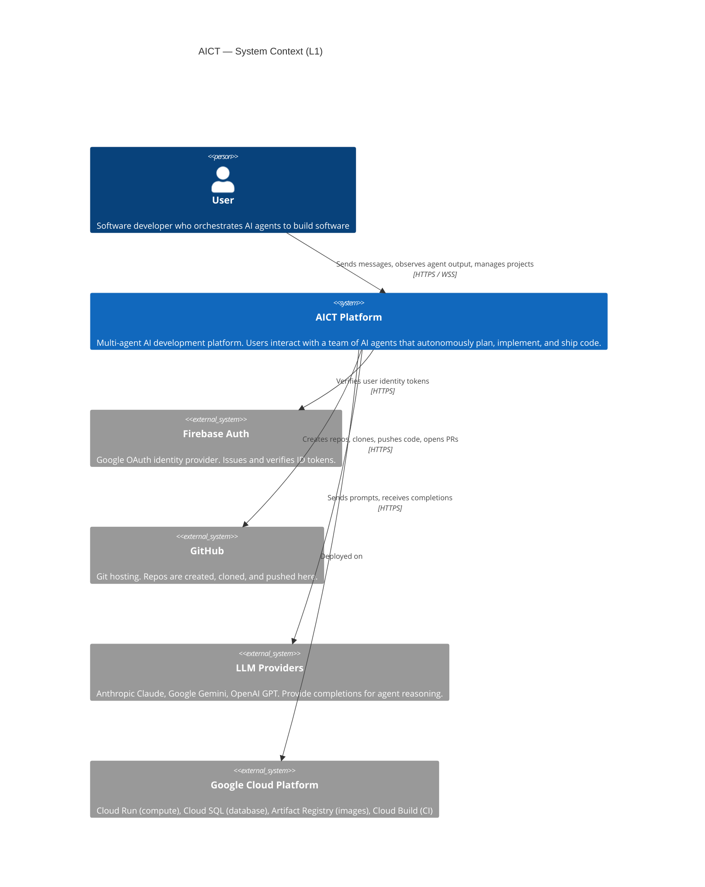
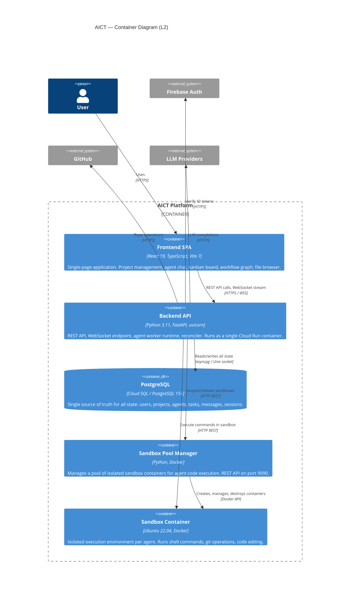
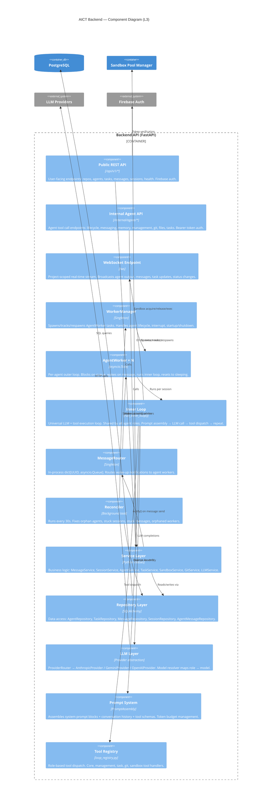

# C4 Architecture Diagrams

## L1 — System Context

Who uses AICT, and what external systems does it depend on?



```
┌─────────────────────────────────────────────────────────────────┐
│                          User                                   │
│         (Developer orchestrating AI coding agents)              │
└──────────────────────────┬──────────────────────────────────────┘
                           │  HTTPS / WSS
                           ▼
┌──────────────────────────────────────────────────────────────────┐
│                                                                  │
│                    AICT Platform                                 │
│                                                                  │
│   Multi-agent AI development platform.                          │
│   Agents plan, implement, and ship code autonomously.           │
│   Users observe and interfere in real time.                     │
│                                                                  │
└───────┬──────────────┬──────────────┬──────────────┬────────────┘
        │              │              │              │
        ▼              ▼              ▼              ▼
  ┌──────────┐  ┌───────────┐  ┌──────────┐  ┌──────────────┐
  │ Firebase │  │  GitHub   │  │   LLM    │  │    GCP       │
  │   Auth   │  │           │  │ Providers│  │ (Cloud Run,  │
  │          │  │ Repo CRUD │  │ Claude   │  │  Cloud SQL,  │
  │ Verifies │  │ Clone     │  │ Gemini   │  │  Artifact    │
  │ ID tokens│  │ Push / PR │  │ GPT      │  │  Registry)   │
  └──────────┘  └───────────┘  └──────────┘  └──────────────┘
```

---

## L2 — Container Diagram

What are the deployable units and how do they communicate?



```
┌───────────────────────────────────────────────────────────────────────────────────┐
│  AICT Platform                                                                    │
│                                                                                   │
│  ┌─────────────────────────┐         ┌────────────────────────────────────────┐  │
│  │   Frontend SPA          │  REST   │         Backend API                    │  │
│  │                         │  WSS    │                                        │  │
│  │  React 19 + TypeScript  │────────▶│  FastAPI + uvicorn (Cloud Run)        │  │
│  │  Vite 7                 │         │                                        │  │
│  │  Tailwind CSS 4         │         │  ┌──────────────┐ ┌────────────────┐  │  │
│  │                         │         │  │ REST API     │ │ WebSocket      │  │  │
│  │  Pages:                 │         │  │ /api/v1/*    │ │ /ws            │  │  │
│  │  - Workspace (chat)     │         │  └──────────────┘ └────────────────┘  │  │
│  │  - Kanban board         │         │  ┌──────────────┐ ┌────────────────┐  │  │
│  │  - Workflow graph       │         │  │ Internal API │ │ Worker Runtime │  │  │
│  │  - Artifacts            │         │  │ /internal/*  │ │ (AgentWorkers) │  │  │
│  │  - Settings             │         │  └──────────────┘ └────────────────┘  │  │
│  └─────────────────────────┘         │  ┌──────────────┐ ┌────────────────┐  │  │
│                                      │  │ Reconciler   │ │ MessageRouter  │  │  │
│                                      │  │ (30s cycle)  │ │ (in-process)   │  │  │
│                                      │  └──────────────┘ └────────────────┘  │  │
│                                      └───────┬───────────────┬───────────────┘  │
│                                              │               │                   │
│                                     asyncpg  │               │ HTTP REST         │
│                                              ▼               ▼                   │
│  ┌─────────────────────────┐         ┌────────────────────────────────────────┐  │
│  │   PostgreSQL            │         │   Sandbox Pool Manager                 │  │
│  │   (Cloud SQL)           │         │   (port 9090)                          │  │
│  │                         │         │                                        │  │
│  │   Tables:               │         │   Manages Docker containers:           │  │
│  │   - users               │         │   ┌────────┐ ┌────────┐ ┌────────┐   │  │
│  │   - repositories        │         │   │ Sandbox│ │ Sandbox│ │ Sandbox│   │  │
│  │   - agents              │         │   │   #1   │ │   #2   │ │  #N    │   │  │
│  │   - tasks               │         │   │Ubuntu  │ │Ubuntu  │ │Ubuntu  │   │  │
│  │   - channel_messages    │         │   └────────┘ └────────┘ └────────┘   │  │
│  │   - agent_sessions      │         └────────────────────────────────────────┘  │
│  │   - agent_messages      │                                                     │
│  └─────────────────────────┘                                                     │
└───────────────────────────────────────────────────────────────────────────────────┘
         ▲                         ▲                         ▲
         │                         │                         │
  Firebase Auth              GitHub API              LLM Providers
  (token verify)          (repo ops, PRs)        (Claude, Gemini, GPT)
```

---

## L3 — Component Diagram: Backend

What are the major components inside the Backend container?



```
┌────────────────────────────────────────────────────────────────────────────────────────┐
│  Backend API (FastAPI + uvicorn)                                                       │
│                                                                                        │
│  ┌─────────────────────────────────────────────────────────────────────────────────┐   │
│  │  HTTP / WebSocket Layer                                                         │   │
│  │                                                                                 │   │
│  │  ┌──────────────┐   ┌──────────────────┐   ┌───────────────────────────────┐   │   │
│  │  │ Public API   │   │ Internal API     │   │ WebSocket Endpoint            │   │   │
│  │  │ /api/v1/*    │   │ /internal/agent/*│   │ /ws?token=...&project_id=...  │   │   │
│  │  │              │   │                  │   │                               │   │   │
│  │  │ Firebase JWT │   │ Bearer token     │   │ Channels:                     │   │   │
│  │  │              │   │                  │   │ agent_stream, messages,       │   │   │
│  │  │ Endpoints:   │   │ Endpoints:       │   │ kanban, agents, activity,     │   │   │
│  │  │ repos, agents│   │ lifecycle,       │   │ backend_logs                  │   │   │
│  │  │ tasks, msgs  │   │ messaging,       │   │                               │   │   │
│  │  │ sessions,    │   │ memory, mgmt,    │   │                               │   │   │
│  │  │ health       │   │ git, files, tasks│   │                               │   │   │
│  │  └──────┬───────┘   └────────┬─────────┘   └──────────────▲────────────────┘   │   │
│  └─────────┼────────────────────┼────────────────────────────┼────────────────────┘   │
│            │                    │                             │                         │
│            ▼                    ▼                             │ emit events              │
│  ┌──────────────────────────────────────┐                    │                         │
│  │  Service Layer                       │                    │                         │
│  │  MessageService, SessionService,     │──notify()──┐      │                         │
│  │  AgentService, TaskService,          │            │      │                         │
│  │  SandboxService, GitService,         │            │      │                         │
│  │  LLMService                          │            │      │                         │
│  └──────────┬───────────────────────────┘            │      │                         │
│             │                                        ▼      │                         │
│             ▼                              ┌──────────────┐ │                         │
│  ┌────────────────────┐                    │ Message      │ │                         │
│  │  Repository Layer  │                    │ Router       │ │                         │
│  │  (SQLAlchemy ORM)  │                    │ dict[UUID,Q] │ │                         │
│  └────────┬───────────┘                    └──────┬───────┘ │                         │
│           │                                       │         │                         │
│           │ SQL                          wake-up   │         │                         │
│           ▼                                       ▼         │                         │
│  ┌─────────────┐   ┌──────────────────────────────────────────────────────────────┐   │
│  │ PostgreSQL  │   │  Worker Runtime                                              │   │
│  │             │   │                                                              │   │
│  │ users       │   │  ┌───────────────┐                                          │   │
│  │ repositories│   │  │ WorkerManager │──spawns──┐                               │   │
│  │ agents      │   │  │ (singleton)   │          │                               │   │
│  │ tasks       │   │  └───────┬───────┘          ▼                               │   │
│  │ channel_msgs│   │          │           ┌─────────────┐  ┌─────────────┐       │   │
│  │ sessions    │   │     respawns         │AgentWorker  │  │AgentWorker  │ ...   │   │
│  │ agent_msgs  │   │                      │ (Manager)   │  │ (Eng-1)     │       │   │
│  │             │   │                      └──────┬──────┘  └──────┬──────┘       │   │
│  └─────────────┘   │                             │                │               │   │
│                    │                             ▼                ▼               │   │
│                    │                      ┌───────────────────────────┐           │   │
│                    │                      │ run_inner_loop()          │──────────▶│   │
│                    │                      │                           │  WS emit  │   │
│                    │                      │ PromptAssembly → LLM →   │           │   │
│                    │                      │ Tool dispatch → repeat   │           │   │
│                    │                      └──────────┬───────────────┘           │   │
│                    │                                 │                            │   │
│                    │  ┌───────────────┐               │                            │   │
│                    │  │ Reconciler    │               ▼                            │   │
│                    │  │ (every 30s)   │        ┌─────────────┐  ┌──────────────┐  │   │
│                    │  │               │        │ LLM Layer   │  │ Tool         │  │   │
│                    │  │ Fix orphans,  │        │             │  │ Registry     │  │   │
│                    │  │ stuck agents, │        │ Router →    │  │              │  │   │
│                    │  │ stuck msgs    │        │ Anthropic / │  │ core, mgmt,  │  │   │
│                    │  └───────────────┘        │ Gemini /    │  │ task, git,   │  │   │
│                    │                           │ OpenAI      │  │ sandbox      │  │   │
│                    │                           └─────────────┘  └──────────────┘  │   │
│                    └──────────────────────────────────────────────────────────────┘   │
└────────────────────────────────────────────────────────────────────────────────────────┘
```

---

## L3 — Component Diagram: Frontend

What are the major components inside the Frontend SPA?

```
┌──────────────────────────────────────────────────────────────────────────────────┐
│  Frontend SPA (React 19 + TypeScript + Vite 7)                                   │
│                                                                                  │
│  ┌────────────────────────────────────────────────────────────────────────────┐  │
│  │  Context Providers                                                         │  │
│  │                                                                            │  │
│  │  ┌──────────────┐  ┌─────────────────┐  ┌───────────────────────────┐     │  │
│  │  │ AuthProvider  │  │ ProjectProvider │  │ AgentStreamProvider       │     │  │
│  │  │              │  │                 │  │                           │     │  │
│  │  │ Firebase     │  │ Active project  │  │ WebSocket connection      │     │  │
│  │  │ token, user  │  │ Project list    │  │ Per-agent stream buffers  │     │  │
│  │  │ Login state  │  │ Selection       │  │ Inspected agent tracking  │     │  │
│  │  └──────────────┘  └─────────────────┘  └───────────────────────────┘     │  │
│  └────────────────────────────────────────────────────────────────────────────┘  │
│                                                                                  │
│  ┌────────────────────────────────────────────────────────────────────────────┐  │
│  │  Pages                                                                     │  │
│  │                                                                            │  │
│  │  ┌────────────┐ ┌──────────────────────────────────────────────────┐       │  │
│  │  │ Login /    │ │ Workspace                                       │       │  │
│  │  │ Register   │ │ Three-column layout:                            │       │  │
│  │  └────────────┘ │ ┌──────────┬──────────────────┬──────────────┐ │       │  │
│  │  ┌────────────┐ │ │ Sidebar  │  Main Content     │ Agents Panel │ │       │  │
│  │  │ Projects   │ │ │          │  - AgentChat      │              │ │       │  │
│  │  │ (list,     │ │ │ Nav +    │  - KanbanBoard    │ Status +     │ │       │  │
│  │  │  create,   │ │ │ Repo     │  - WorkflowGraph  │ Inspector    │ │       │  │
│  │  │  import)   │ │ │ Select   │  - ArtifactBrowser│              │ │       │  │
│  │  └────────────┘ │ └──────────┴──────────────────┴──────────────┘ │       │  │
│  │  ┌────────────┐ └──────────────────────────────────────────────────┘       │  │
│  │  │ Settings   │                                                            │  │
│  │  │ (user +    │                                                            │  │
│  │  │  project)  │                                                            │  │
│  │  └────────────┘                                                            │  │
│  └────────────────────────────────────────────────────────────────────────────┘  │
│                                                                                  │
│  ┌────────────────────────────────────────────────────────────────────────────┐  │
│  │  Hooks                                                                     │  │
│  │                                                                            │  │
│  │  useAgents    useMessages    useAgentStream    useSessions    useTasks     │  │
│  │  (poll+WS)    (REST+WS)     (WS buffer)       (REST)         (REST+WS)    │  │
│  └────────────────────────────────────────────────────────────────────────────┘  │
│                                                                                  │
│  ┌────────────────────────────────────────────────────────────────────────────┐  │
│  │  API Client (api/client.ts)                                                │  │
│  │                                                                            │  │
│  │  ┌───────────────────────┐   ┌────────────────────────────────────┐        │  │
│  │  │ REST Client           │   │ WebSocket Client                   │        │  │
│  │  │ request<T>(method,    │   │ connect(), disconnect(),           │        │  │
│  │  │   path, body)         │   │ subscribe(handler),                │        │  │
│  │  │ Auth header injection │   │ Exponential backoff reconnect     │        │  │
│  │  └───────────────────────┘   └────────────────────────────────────┘        │  │
│  └────────────────────────────────────────────────────────────────────────────┘  │
└──────────────────────────────────────────────────────────────────────────────────┘
```
