# AICT System Architecture

> Last updated: 2026-03-26

---

## High-Level Overview

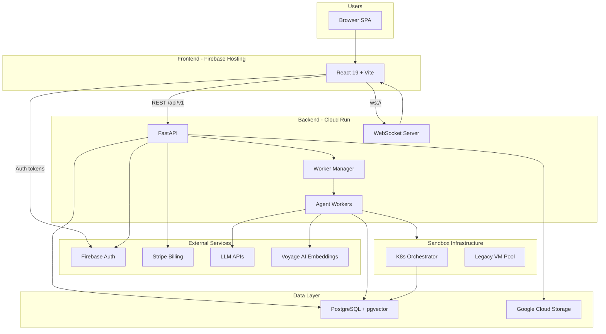

---

## Backend Architecture

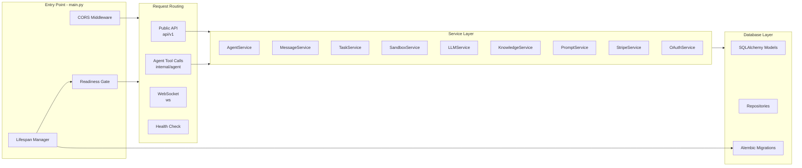

---

## Agent Execution Loop

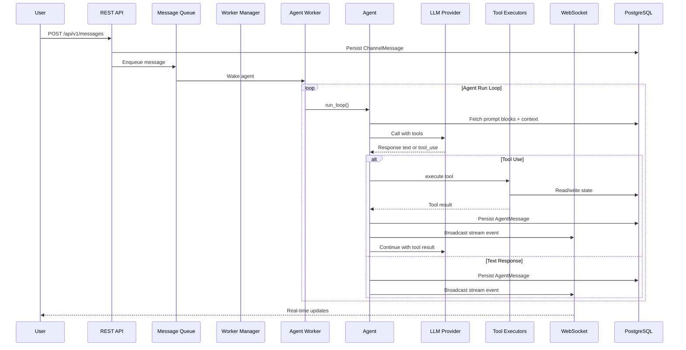

---

## LLM Provider Routing

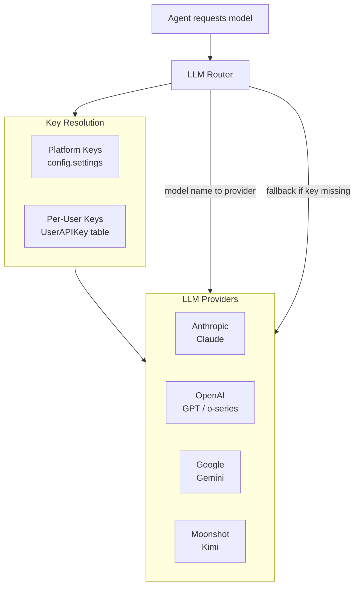

---

## Tool System

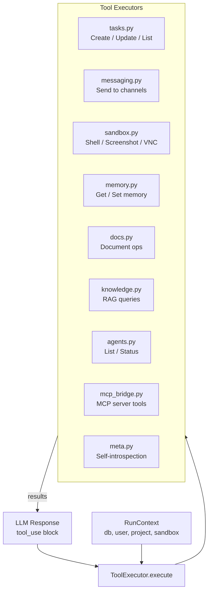

---

## Database Schema

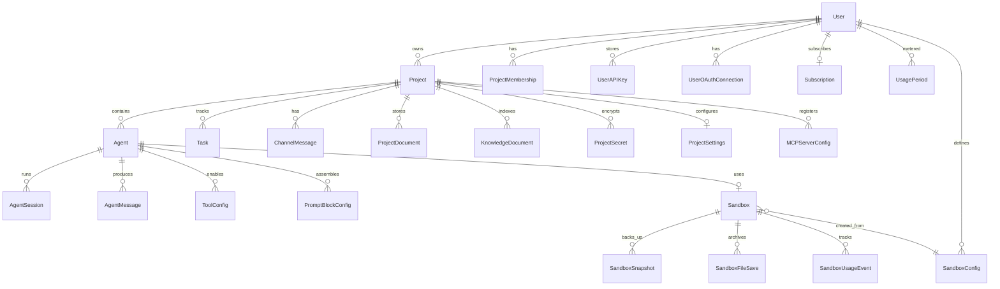

---

## Worker & Real-Time System

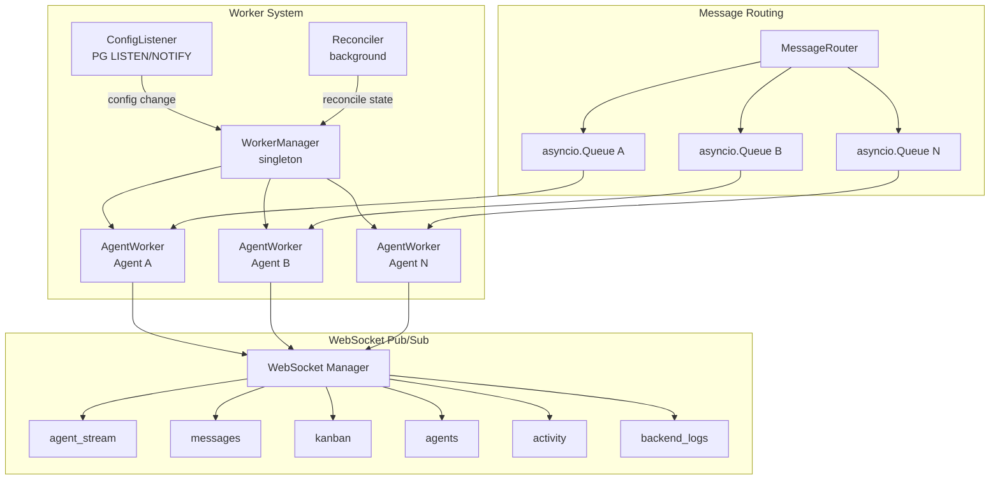

---

## Sandbox Architecture

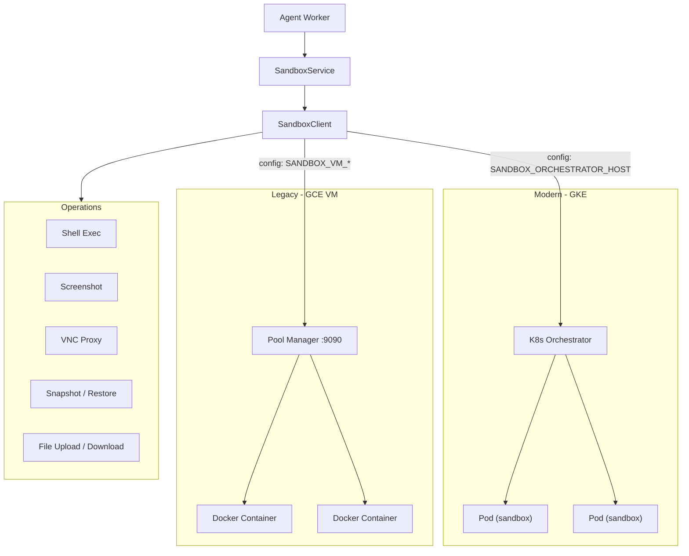

---

## Frontend Architecture

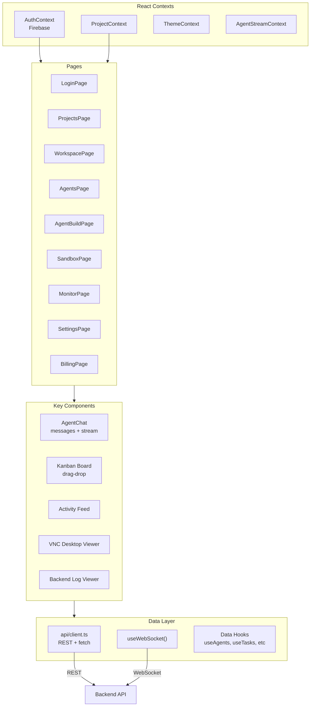

---

## Auth & Access Control

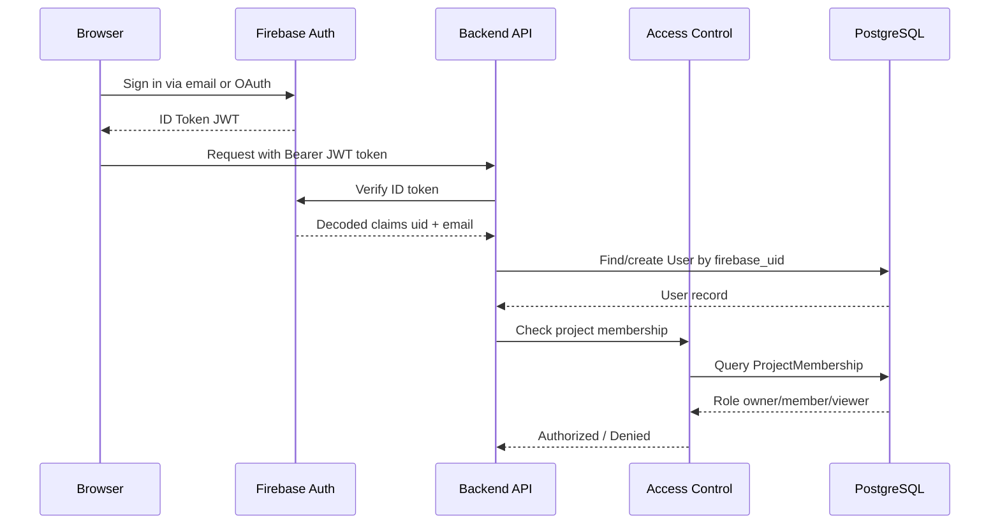

---

## CI/CD Pipeline

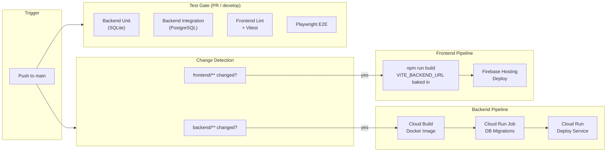

---

## Data Flow: End-to-End Message

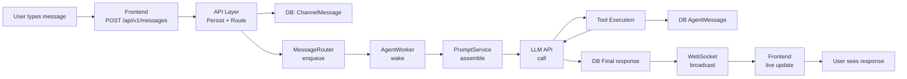
